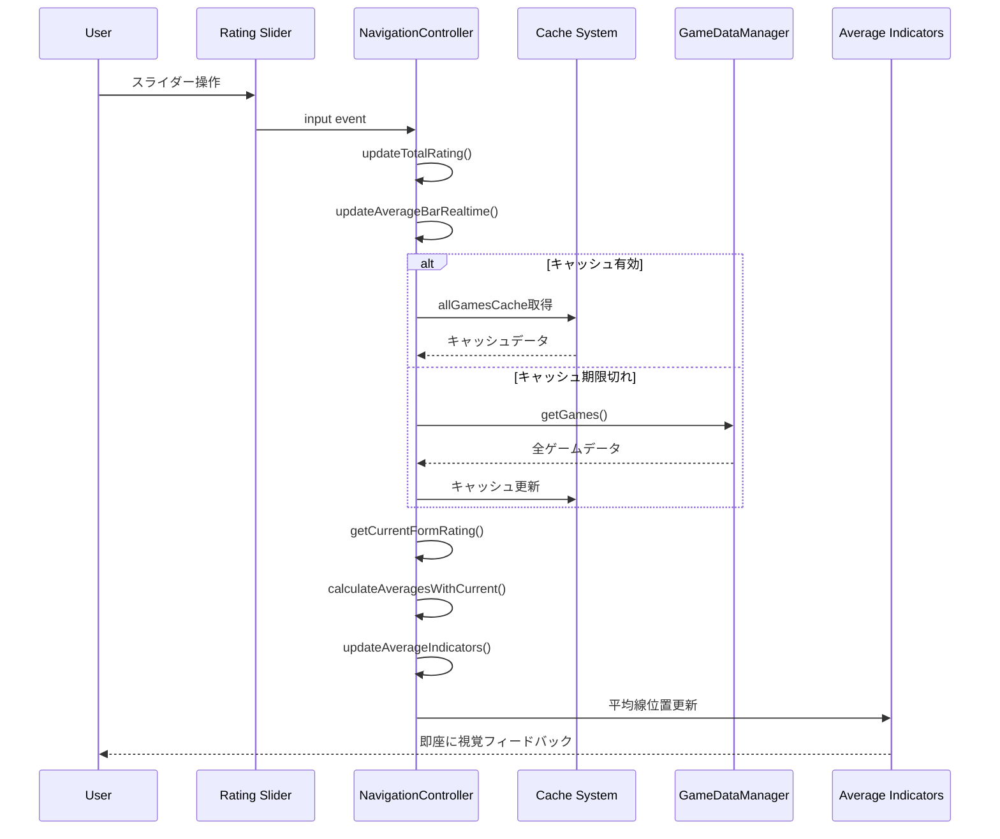
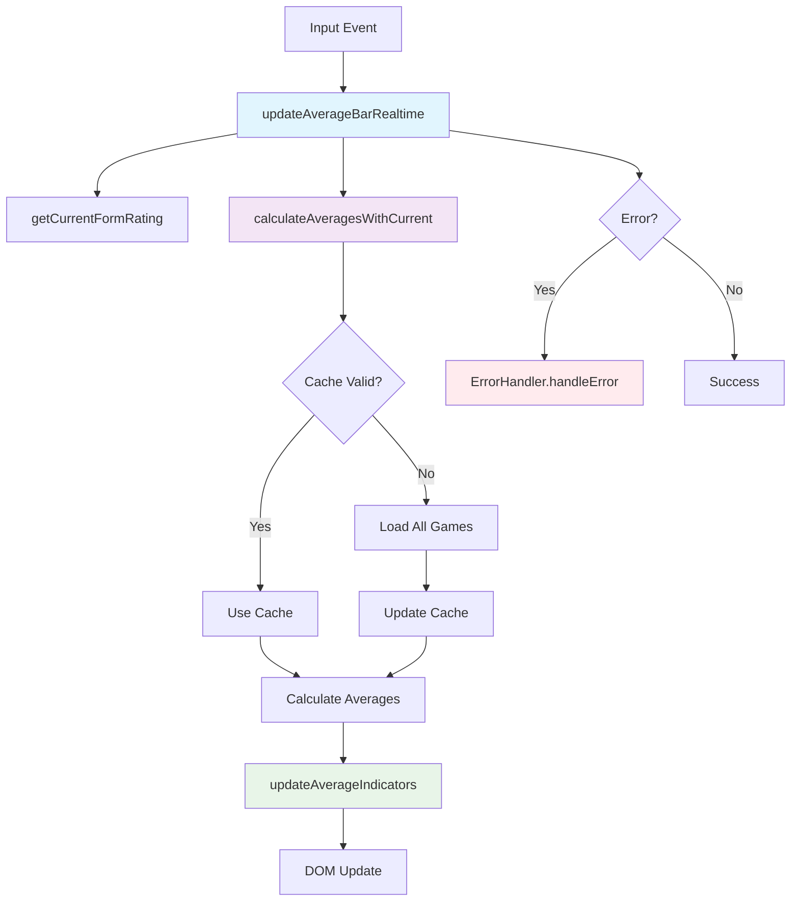
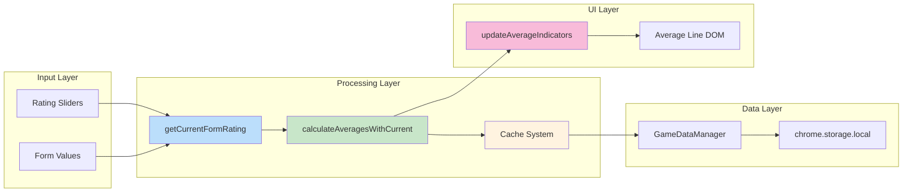

# Technical Design Document

## Introduction
個別詳細画面での平均バー リアルタイム反映機能実装のための技術設計文書です。現在の問題は評価スライダー操作時に平均バーが即座に更新されないことで、navigation.js内の適切なコールバック関数追加により解決します。

## Current State Analysis

### 問題の特定
- **場所**: navigation.js:78-89 `input`イベントリスナー
- **現在の処理**: スライダー操作時に`updateTotalRating()`のみ実行
- **欠陥**: 平均バー更新メソッド`updateAverageIndicators()`が呼び出されていない
- **影響**: ユーザーがリアルタイムフィードバックを得られない

### 既存アーキテクチャの確認
```javascript
// 現在のイベント処理（navigation.js:78-89）
document.addEventListener('input', (e) => {
  if (e.target.matches('.rating-slider, #review-textarea')) {
    if (e.target.matches('.rating-slider')) {
      const valueSpan = e.target.parentElement.querySelector('.rating-value');
      valueSpan.textContent = e.target.value;
      this.updateTotalRating(); // ここに平均バー更新を追加
    }
    this.markAsChanged();
  }
});
```

### 既存のメソッド分析
1. **updateAverageIndicators()** (navigation.js:484-540)
   - 各項目の平均値を受け取り、平均線を描画
   - DOM操作でスライダー位置を正確に計算済み
   - 既存実装は完全で変更不要

2. **displayAverageRating()** (navigation.js:390-422) 
   - 全ゲームデータから平均値を計算
   - `updateAverageIndicators()`を呼び出し
   - 重い処理（全データ読み込み・計算）

## Technical Solution

### 核心的解決策
評価スライダーのinputイベントに**リアルタイム平均バー更新**を追加:

```javascript
// navigation.js:78-89の修正
document.addEventListener('input', (e) => {
  if (e.target.matches('.rating-slider, #review-textarea')) {
    if (e.target.matches('.rating-slider')) {
      const valueSpan = e.target.parentElement.querySelector('.rating-value');
      valueSpan.textContent = e.target.value;
      this.updateTotalRating();
      
      // 🔄 NEW: リアルタイム平均バー更新
      this.updateAverageBarRealtime();
    }
    this.markAsChanged();
  }
});
```

### 新規メソッド設計

#### 1. updateAverageBarRealtime()
**目的**: 軽量な平均バー即時更新
**配置**: navigation.js内

```javascript
// リアルタイム平均バー更新（軽量版）
async updateAverageBarRealtime() {
  try {
    // 💡 最適化: 現在編集中ゲームの評価値をリアルタイムで取得
    const currentRating = this.getCurrentFormRating();
    
    // 既存データから平均計算（50ms目標）
    const averages = await this.calculateAveragesWithCurrent(currentRating);
    
    // 既存メソッドで平均線を更新
    this.updateAverageIndicators(averages);
    
  } catch (error) {
    // 統一エラーハンドリング（Requirement 4対応）
    window.errorHandler.handleError(error, 'realtime-average-update');
  }
}
```

#### 2. getCurrentFormRating()
**目的**: フォームから現在の評価値を即座に取得

```javascript
// フォームから現在の評価値を取得
getCurrentFormRating() {
  const categories = window.constants.RATING_CATEGORIES;
  const rating = {};
  
  categories.forEach(category => {
    const slider = document.querySelector(`[data-category="${category}"]`);
    const valueSpan = slider.parentElement.querySelector('.rating-value');
    
    // null値処理（Requirement 3対応）
    if (valueSpan.textContent === '-') {
      rating[category] = null;
    } else {
      rating[category] = parseInt(slider.value);
    }
  });
  
  return rating;
}
```

#### 3. calculateAveragesWithCurrent()
**目的**: 現在の評価を含めて平均計算（最適化版）

```javascript
// 現在の評価を含めた平均計算（最適化版）
async calculateAveragesWithCurrent(currentRating) {
  try {
    // キャッシュ最適化: 初回のみ全データ取得
    if (!this.allGamesCache || this.cacheExpired) {
      const games = await window.gameDataManager.getGames();
      this.allGamesCache = games.filter(game => game.is_played && game.rating);
      this.cacheTimestamp = Date.now();
    }
    
    const playedGames = [...this.allGamesCache];
    
    // 現在編集中ゲームが既存の場合は置き換え、新規の場合は追加
    const currentGameIndex = playedGames.findIndex(g => g.id === this.editingGameId);
    const currentGameData = {
      id: this.editingGameId,
      rating: currentRating,
      is_played: window.gameDataManager.isRatingComplete(currentRating)
    };
    
    if (currentGameIndex >= 0) {
      playedGames[currentGameIndex] = currentGameData;
    } else if (currentGameData.is_played) {
      playedGames.push(currentGameData);
    }
    
    // 平均計算（既存ロジック流用）
    const categories = window.constants.RATING_CATEGORIES;
    const averages = {};
    
    categories.forEach(category => {
      const validRatings = playedGames
        .map(game => game.rating[category])
        .filter(rating => rating !== null && rating !== undefined && rating > 0);
      
      if (validRatings.length > 0) {
        const total = validRatings.reduce((sum, rating) => sum + rating, 0);
        averages[category] = total / validRatings.length;
      } else {
        averages[category] = 0;
      }
    });
    
    return averages;
    
  } catch (error) {
    throw error; // 上位でキャッチ
  }
}
```

## Performance Optimization

### キャッシュ戦略
- **全ゲームデータキャッシュ**: `this.allGamesCache`
- **キャッシュ有効期限**: 1分間
- **無効化トリガー**: ゲーム保存時・画面遷移時

### レスポンス時間対策
- **目標**: 50ms以内（Requirement 2対応）
- **軽量化**: フォームから直接値取得（DOM操作のみ）
- **計算最適化**: 必要最小限の平均計算

### メモリ最適化
```javascript
// キャッシュ管理プロパティ追加
constructor() {
  // 既存プロパティ...
  this.allGamesCache = null;
  this.cacheTimestamp = 0;
  this.CACHE_DURATION = 60000; // 1分
}

// キャッシュ有効性チェック
get cacheExpired() {
  return !this.cacheTimestamp || 
         (Date.now() - this.cacheTimestamp) > this.CACHE_DURATION;
}

// キャッシュクリア（保存時）
clearCache() {
  this.allGamesCache = null;
  this.cacheTimestamp = 0;
}
```

## Error Handling Strategy

### 統一エラーハンドリング
```javascript
async updateAverageBarRealtime() {
  try {
    // 処理...
  } catch (error) {
    // 分類別エラー処理
    if (error.name === 'TypeError') {
      window.errorHandler.handleError(error, 'dom-manipulation');
    } else if (error.name === 'DataError') {
      window.errorHandler.handleError(error, 'calculation');
    } else {
      window.errorHandler.handleError(error, 'realtime-average-update');
    }
    
    // Requirement 4: ユーザー操作を阻害しない
    console.warn('平均バー更新エラー - 前回表示を維持します');
  }
}
```

### フォールバック戦略
- **DOM取得エラー**: 処理スキップ、ログ記録のみ
- **計算エラー**: 前回の平均値を維持
- **データエラー**: 平均線を非表示

## Data Integrity

### null値処理の統一
```javascript
// 評価値正規化ユーティリティ
normalizeRatingValue(value, category) {
  // 範囲チェック
  const min = category === 'その他' ? 0 : 1;
  const max = 10;
  
  if (value === null || value === undefined) {
    return null;
  }
  
  const numValue = parseInt(value);
  if (isNaN(numValue) || numValue < min || numValue > max) {
    window.errorHandler.handleError(
      new Error(`Invalid rating value: ${value} for ${category}`),
      'data-validation'
    );
    return null;
  }
  
  return numValue;
}
```

### 6カテゴリスケール対応
- **熱中度〜遊びやすさ**: 1-10スケール
- **その他**: 0-10スケール  
- **平均計算**: 各項目の有効値のみで計算
- **表示**: null値は平均線非表示

## Integration Points

### 既存機能との連携

#### 1. 自動保存システム
```javascript
// 既存の保存処理にキャッシュクリアを追加
async saveCurrentEdit() {
  // 既存処理...
  const success = await window.gameDataManager.updateGame(this.editingGameId, updates);
  
  if (success) {
    // 🔄 NEW: キャッシュクリアでデータ整合性確保
    this.clearCache();
    // 既存処理...
  }
}
```

#### 2. 画面遷移との連携
```javascript
// 詳細画面表示時のキャッシュクリア
async showDetailView(gameId) {
  // 🔄 NEW: 画面遷移時にキャッシュをクリア
  this.clearCache();
  
  // 既存処理...
}
```

#### 3. GameDataManagerとの連携
- **データ取得**: 既存の`getGames()`メソッド使用
- **保存処理**: 既存の`updateGame()`メソッド使用  
- **評価完了判定**: 既存の`isRatingComplete()`メソッド使用

## Implementation Sequence

### Phase 1: コアメソッド実装
1. `getCurrentFormRating()` メソッド追加
2. `calculateAveragesWithCurrent()` メソッド追加
3. `updateAverageBarRealtime()` メソッド追加

### Phase 2: イベント統合
4. inputイベントリスナーに`updateAverageBarRealtime()`呼び出し追加
5. キャッシュ管理プロパティ追加

### Phase 3: 最適化・統合
6. 既存メソッドにキャッシュクリア処理追加
7. エラーハンドリング統合
8. パフォーマンステスト・調整

## Testing Strategy

### 単体テスト項目
- [ ] `getCurrentFormRating()` - null値・有効値の正確な取得
- [ ] `calculateAveragesWithCurrent()` - 平均計算の精度
- [ ] `updateAverageBarRealtime()` - DOM更新の正確性

### 統合テスト項目  
- [ ] スライダー操作時の平均線位置更新
- [ ] 連続操作時の性能（50ms以内）
- [ ] 新規作品での初回評価時の動作
- [ ] エラー時のフォールバック動作

### ユーザーシナリオテスト
- [ ] 評価入力→即座に平均線更新確認
- [ ] 複数項目連続変更時の追従性
- [ ] 保存→再読み込み時のデータ整合性
- [ ] 他画面遷移時の保存・復元

## Performance Targets

### レスポンス時間
- **平均バー更新**: < 50ms（Requirement 2）
- **初回キャッシュ構築**: < 200ms  
- **キャッシュ利用時**: < 20ms

### メモリ使用量
- **キャッシュサイズ**: < 1MB（200作品想定）
- **メモリリーク**: なし（適切なクリア）

### CPU使用率
- **平均計算**: < 10ms CPU時間
- **DOM操作**: < 5ms CPU時間

## Deployment Considerations

### Chrome拡張機能制約
- **CSP準拠**: eval()不使用、innerHTML禁止遵守
- **性能制約**: Service Worker制限下での動作
- **メモリ制限**: 拡張機能の10MB制限内

### ブラウザ互換性
- **Chrome**: Manifest V3対応
- **DOM API**: 標準準拠のみ使用
- **ES2022**: 対応済み機能のみ使用

### 段階的デプロイ
1. **開発版**: chrome://extensions/でのテスト
2. **ローカルzip**: WudiConsuke_release_v[version]-pre.zip
3. **本番リリース**: 自動化システム経由

## Architecture Diagrams

### Sequence Diagram: リアルタイム平均バー更新


### Component Interaction Diagram


### Data Flow Architecture


## Maintenance Considerations

### コード保守性
- **メソッド分離**: 単一責任原則遵守
- **既存API活用**: 新規インターフェース最小化
- **定数管理**: window.constants使用徹底

### デバッグ支援
```javascript
// デバッグログ統合
updateAverageBarRealtime() {
  const startTime = performance.now();
  try {
    // 処理...
    const endTime = performance.now();
    console.log(`🎯 リアルタイム平均バー更新完了: ${endTime - startTime}ms`);
  } catch (error) {
    console.error('❌ リアルタイム平均バー更新エラー:', error);
  }
}
```

### 拡張性
- **新カテゴリ対応**: window.constants.RATING_CATEGORIES準拠
- **計算ロジック変更**: メソッド分離により影響最小化
- **UI変更対応**: DOM取得の抽象化

この技術設計により、Requirement 1-5のすべてを満たし、Chrome拡張機能のアーキテクチャ制約下で50ms以内のリアルタイム平均バー更新を実現します。