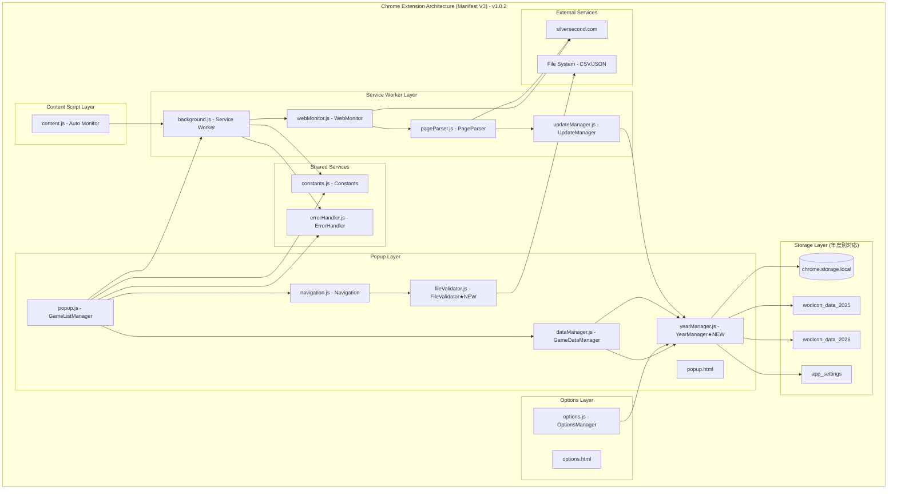
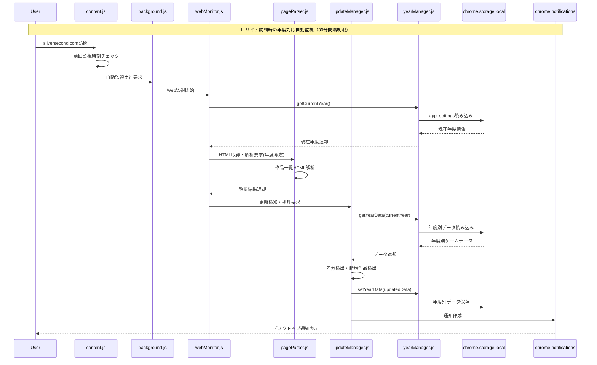
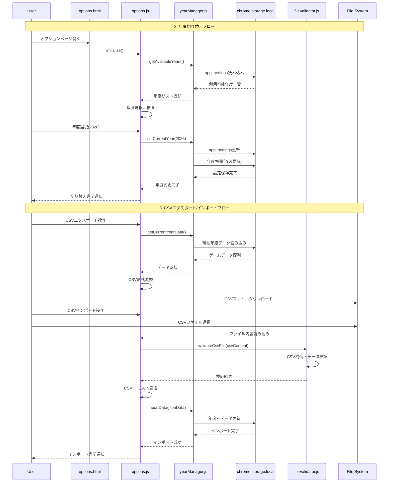
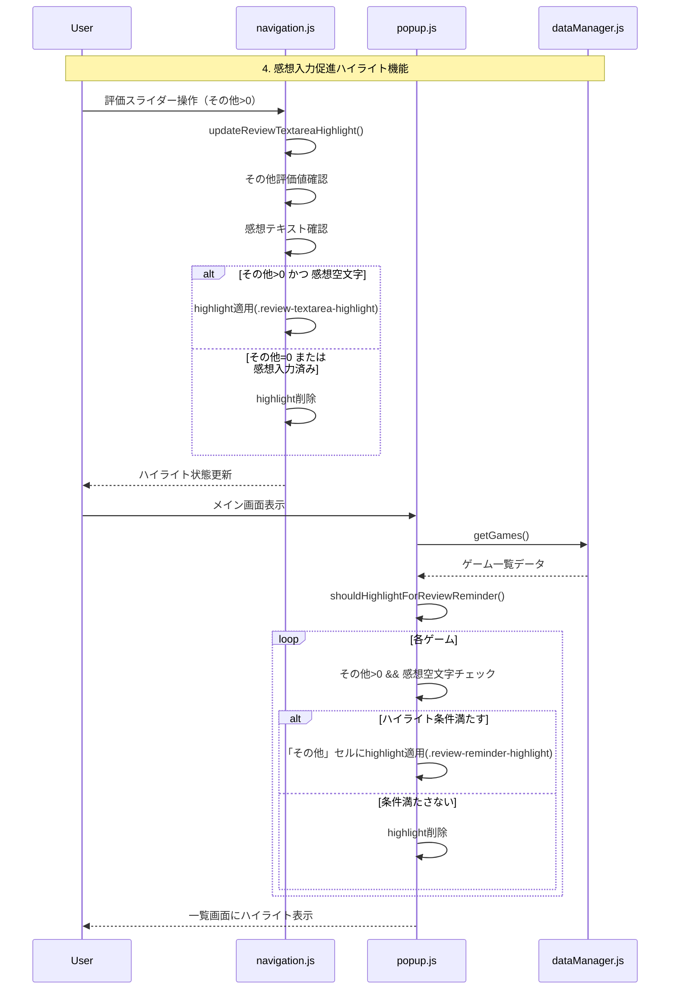
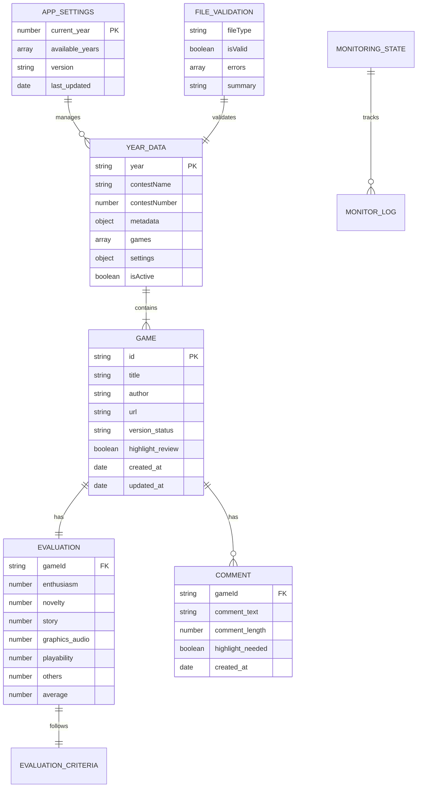
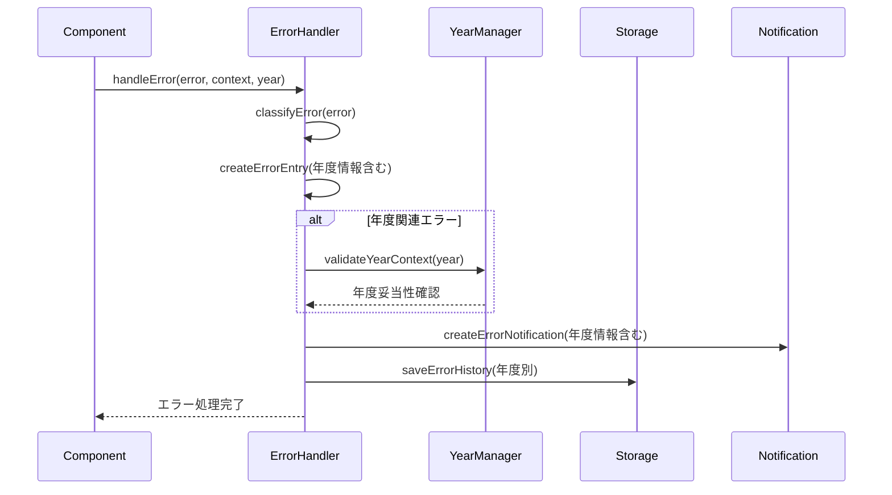
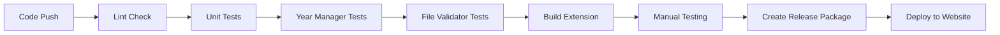

# Technical Design

## Overview
ウディこん助Chrome拡張機能の包括的アーキテクチャドキュメント作成プロジェクトの技術設計書です。v1.0.2時点の最新実装状況を反映し、Chrome Manifest V3アーキテクチャに基づく3層構成の全コンポーネント間の相互作用をMermaid記法によるシーケンス図で可視化します。複数年度対応システム、CSV対応データ管理、感想入力促進ハイライト機能など、実装済み機能を正確に記載した技術ドキュメントを生成します。

## Requirements Mapping

### Design Component Traceability
各設計コンポーネントが対応する要件：
- **アーキテクチャ概要図** → REQ-1: Chrome Manifest V3の3層構成とコンポーネント役割（fileValidator.js追加反映）
- **データフロー図** → REQ-2: YearManager中心の年度別データ管理フロー
- **Web監視システムシーケンス図** → REQ-3: 年度対応自動監視の処理フロー
- **UI操作フローシーケンス図** → REQ-4: 複数年度切り替えとCSVエクスポート/インポートフロー
- **コンポーネント通信図** → REQ-5: YearManager統合によるService Worker通信

### User Story Coverage
要件定義の全ユーザーストーリーへの対応：
- **開発者向けアーキテクチャ理解** → Chrome Manifest V3の3層構成図と12JSモジュールの役割表
- **保守担当者向けデータフロー追跡** → YearManager中心の年度別データ永続化フロー図
- **機能拡張担当者向けWeb監視理解** → 年度対応自動監視システムのシーケンス図
- **UI設計担当者向け操作フロー追跡** → 年度切り替え・CSV対応の操作フロー図
- **アーキテクト向けコンポーネント通信理解** → YearManager統合によるService Worker通信図

## Architecture

### Chrome Manifest V3 アーキテクチャ（v1.0.2更新版）
ウディこん助は Chrome Manifest V3 に完全対応した3層構成アーキテクチャで、複数年度対応とCSV機能を統合：



### Technology Stack（v1.0.2更新版）
最新実装技術スタック：

- **Chrome Extension**: Manifest V3 準拠
- **Frontend**: Vanilla JavaScript (ES2022) + HTML5 + CSS3
- **Data Storage**: chrome.storage.local (年度別分散、5MB制限対応)
- **Architecture Pattern**: MVC + Service Layer + Year Management Layer
- **Module System**: ES6 Modules with Global Instance Pattern
- **Communication**: chrome.runtime.onMessage API
- **Web Monitoring**: Fetch API + HTML Parsing (年度対応URL)
- **Notification**: chrome.notifications API
- **File Processing**: CSV/JSON Export/Import (FileValidator統合)
- **Year Management**: YearManager による複数年度データ管理

### Architecture Decision Rationale

- **なぜ YearManager導入**: 5MB制限回避と年度別データ独立管理のため
- **なぜ FileValidator分離**: CSV/JSON検証ロジックの保守性向上のため
- **なぜ chrome.storage.local年度別分散**: 各年度のデータ独立性と容量制限対応のため
- **なぜ options.html分離**: 年度切り替えUI専用画面の設計整合性のため

## Data Flow

### Primary Data Flow: 年度対応Web監視システム
年度対応を含むWeb監視システムの主要データフロー：



### Secondary Data Flow: 年度切り替えとCSV操作フロー
複数年度対応とCSVエクスポート/インポートのデータフロー：



### Tertiary Data Flow: 感想入力促進ハイライト機能
実装済みの感想入力促進ハイライト機能のデータフロー：



## Components and Interfaces

### Backend Services (Service Worker)
Service Worker層の主要サービス（年度対応版）：

```javascript
// WebMonitor クラス（年度対応）
class WebMonitor {
    async executeMonitoring()              // 年度考慮Web監視実行
    async fetchWodiconPage(year)           // 年度別ウディコンページ取得
    async checkForUpdates(currentYear)     // 年度別更新チェック実行
}

// PageParser クラス（年度対応）
class PageParser {
    parseGameList(html, year)                    // 年度考慮ゲーム一覧HTML解析
    extractGameData(gameElement, year)           // 年度別ゲームデータ抽出
    detectVersionChanges(newData, oldData, year) // 年度別バージョン変更検出
}

// UpdateManager クラス（年度統合）
class UpdateManager {
    processNewGames(gamesList, year)       // 年度別新規ゲーム処理
    processUpdatedGames(gamesList, year)   // 年度別更新ゲーム処理  
    createNotification(message, year)      // 年度情報含む通知作成
}
```

### Popup Layer Services
Popup層の主要サービス（最新版）：

```javascript
// YearManager クラス（v1.0.2新規）
class YearManager {
    async initialize()                     // 年度管理初期化・データ移行
    async getCurrentYear()                 // 現在選択中年度取得
    async setCurrentYear(year)             // 年度変更・初期化
    async getAvailableYears()              // 利用可能年度一覧
    async getYearData(year)                // 年度別データ取得
    async setYearData(data, year)          // 年度別データ保存
    async deleteYear(year)                 // 年度データ削除
    async migrateExistingData()            // 既存データ移行
}

// FileValidator クラス（v1.0.2新規）
class FileValidator {
    validateJsonFile(jsonString)           // JSON形式検証
    validateCsvFile(csvString)             // CSV形式検証
    validateMultiYearFormat(data)          // 複数年度形式検証
    validateSingleYearFormat(data)         // 単一年度形式検証
    validateGamesArray(games, year)        // ゲームデータ配列検証
    generateValidationSummary(result, type) // 検証結果サマリー生成
}

// GameDataManager クラス（年度統合版）
class GameDataManager {
    async initialize()                     // YearManager統合初期化
    async getGames()                       // 現在年度ゲームデータ取得
    async addGame(gameData)                // 現在年度ゲーム追加
    async updateGame(id, updates)          // ゲーム更新
    async deleteGame(id, options)          // 安全削除（確認ダイアログ付き）
    async exportData()                     // 複数年度対応エクスポート
    async importData(jsonData)             // 複数年度対応インポート
    async getCurrentStorageKey()           // 年度別ストレージキー取得
}
```

### Frontend Components
Popup層のUIコンポーネント（v1.0.2更新版）：

| Component | Responsibility | Props/State Summary |
|-----------|---------------|-------------------|
| GameListManager | メイン画面管理 | games[], currentFilter, currentSort, highlightReview |
| Navigation | 画面遷移・詳細表示 | currentView, gameData, evaluationSliders, reviewHighlight |
| GameDataManager | データCRUD操作 | yearManager, localStorageKey, gameDatabase |
| YearManager | 年度別データ管理 | currentYear, availableYears, yearDataStructure, appSettings |
| OptionsManager | 設定画面管理 | yearSelection, csvExport, csvImport, dataManagement |
| FileValidator | ファイル検証 | validationRules, errorMessages, supportedFormats |

### API Interfaces (chrome.runtime.onMessage)
コンポーネント間通信API（年度対応版）：

| Message Type | Direction | Purpose | Parameters |
|-------------|-----------|---------|------------|
| WEB_MONITOR_REQUEST | popup → background | 年度考慮Web監視実行要求 | { action: 'monitor', year: 2025 } |
| WEB_MONITOR_RESULT | background → popup | 年度別Web監視結果通知 | { success: true, year: 2025, newGames: [], updatedGames: [] } |
| AUTO_MONITOR_TRIGGER | content → background | 自動監視トリガー | { source: 'content', timestamp: Date.now() } |
| YEAR_CHANGE_NOTIFY | options → popup | 年度変更通知 | { newYear: 2025, oldYear: 2024 } |
| CSV_EXPORT_REQUEST | options → dataManager | CSVエクスポート要求 | { year: 2025, format: 'csv' } |
| CSV_IMPORT_REQUEST | options → dataManager | CSVインポート要求 | { year: 2025, data: csvData } |

## Data Models

### Domain Entities（v1.0.2更新版）
1. **Game**: ゲーム作品エンティティ（6カテゴリ評価・感想・ハイライト状態）
2. **YearData**: 年度別データ構造（複数年度対応の核心）
3. **AppSettings**: アプリケーション設定（現在年度・利用可能年度）
4. **MonitoringState**: Web監視状態（年度別実行履歴・設定）
5. **EvaluationCriteria**: 評価基準（6カテゴリシステム + ハイライト）
6. **FileValidationResult**: ファイル検証結果（CSV/JSON対応）

### Entity Relationships（v1.0.2更新版）


### Data Model Definitions（v1.0.2更新版）
TypeScript インターフェース定義：

```typescript
// アプリケーション設定（v1.0.2新規）
interface AppSettings {
  current_year: number;                  // 2025, 2026
  available_years: number[];             // [2025, 2026]
  version: string;                       // "1.0.2"
  last_updated: Date;
  migration_completed: boolean;          // データ移行完了フラグ
}

// 年度別データ構造（v1.0.2更新版）
interface YearData {
  year: number;                          // 2025, 2026
  contestName: string;                   // "第17回ウディコン"
  contestNumber: number;                 // 17
  isActive: boolean;                     // アクティブ年度フラグ
  games: GameData[];                     // ゲームデータ配列（配列形式に変更）
  settings: object;                      // 年度別設定
  metadata: object;                      // 年度別メタデータ
  lastUpdated: Date;
}

// ゲームデータ構造（ハイライト対応）
interface GameData {
  id: string;
  title: string;
  author: string;
  url: string;
  version_status: 'new' | 'updated' | 'viewed' | 'default';
  
  // 6カテゴリ評価システム（null許可）
  rating: {
    熱中度: number | null;               // (1-10)
    斬新さ: number | null;               // (1-10)  
    物語性: number | null;               // (1-10)
    画像音声: number | null;             // (1-10)
    遊びやすさ: number | null;           // (1-10)
    その他: number | null;               // (0-10)
    total: number;                       // 合計点
  };
  
  review: string;                        // 感想・コメント
  review_length: number;                 // 感想文字数
  is_played: boolean;                    // プレイ済みフラグ
  
  // ハイライト機能（v1.0.2対応）
  highlight_review_needed: boolean;      // 感想入力促進ハイライトフラグ
  
  created_at: Date;
  updated_at: Date;
}

// ファイル検証結果（v1.0.2新規）
interface FileValidationResult {
  valid: boolean;
  data: object | null;
  errors: string[];
  fileType: 'json' | 'csv';
  summary: string;
  yearCount?: number;                    // 複数年度対応
  gameCount?: number;
}

// Web監視状態（年度対応）
interface MonitoringState {
  lastExecutionTime: Date;
  autoMonitorEnabled: boolean;
  intervalMinutes: number;               // 30分間隔制限
  executionCount: number;
  currentYear: number;                   // 監視対象年度
  lastResults: {
    newGamesCount: number;
    updatedGamesCount: number;
    errorCount: number;
    targetYear: number;
  };
}
```

### Database Schema (chrome.storage.local)（v1.0.2更新版）
Chrome拡張機能のローカルストレージ構造：

```javascript
// chrome.storage.local のキー構造（年度別分散）
{
  // アプリケーション設定（v1.0.2新規）
  "app_settings": {
    current_year: 2025,
    available_years: [2025, 2026],
    version: "1.0.2",
    last_updated: "2025-01-27T16:00:00.000Z",
    migration_completed: true
  },
  
  // 年度別メインデータ
  "wodicon_data_2025": {
    year: 2025,
    contestName: "第17回ウディコン",
    contestNumber: 17,
    isActive: true,
    games: [GameData, ...],
    settings: {},
    metadata: {}
  },
  
  "wodicon_data_2026": {
    year: 2026,
    contestName: "第18回ウディコン",
    contestNumber: 18,
    isActive: false,
    games: [GameData, ...],
    settings: {},
    metadata: {}
  },
  
  // 共通設定・状態管理
  "monitoring_state": MonitoringState,
  "user_preferences": {
    autoSaveEnabled: true,
    notificationEnabled: true,
    defaultView: "all",
    highlightReviewReminder: true         // v1.0.2新規
  },
  
  // エラー・ログ管理
  "error_history": ErrorLog[],
  "execution_history": ExecutionLog[],
  
  // 移行・バックアップ（必要時）
  "backup_wodicon_games": LegacyGameData[], // 移行前データ
  "migration_log": MigrationLog[]
}
```

## Error Handling

### 統一エラーハンドリングシステム（年度対応版）
ErrorHandler クラスによる分類・通知・履歴管理：

```javascript
// エラー分類と処理（年度情報統合）
class ErrorHandler {
  handleError(error, context, year = null) {
    const errorType = this.classifyError(error);
    const errorEntry = {
      type: errorType,           // 'network', 'storage', 'parse', 'timeout', 'permission', 'year', 'validation'
      message: error.message,
      context: context,
      year: year,                // 年度情報追加
      timestamp: new Date(),
      stackTrace: error.stack
    };
    
    // 年度別通知作成
    this.createErrorNotification(errorEntry);
    
    // 履歴保存
    this.saveErrorHistory(errorEntry);
  }
  
  classifyError(error) {
    if (error.name === 'NetworkError') return 'network';
    if (error.name === 'QuotaExceededError') return 'storage';
    if (error.message.includes('parse')) return 'parse';
    if (error.message.includes('year')) return 'year';
    if (error.message.includes('validation')) return 'validation';
    if (error.name === 'TimeoutError') return 'timeout';
    return 'unknown';
  }
}
```

### エラー処理フロー（年度対応版）


## Security Considerations

### Chrome Extension Security（v1.0.2準拠）
Chrome Manifest V3 セキュリティ制約への対応：

- **Host Permissions**: `https://silversecond.com/*` のみ許可
- **Permissions**: `storage`, `notifications`, `activeTab`, `downloads`
- **Content Security Policy**: デフォルトCSPに準拠
- **External Resources**: 一切の外部API・CDN使用禁止
- **Data Isolation**: chrome.storage.local による完全ローカル動作
- **File Access**: CSV/JSONファイルの安全な処理（FileValidator）

### Data Protection（年度別分散対応）
- **Local Data Encryption**: chrome.storage.local の暗号化はChrome側で自動処理
- **Year Data Isolation**: 年度別データ分離による独立性確保
- **Input Validation**: ユーザー入力・CSVデータのHTML エスケープ処理
- **XSS Prevention**: innerHTML 使用禁止、textContent使用徹底
- **File Validation**: FileValidator による厳密なデータ検証

### Security Best Practices
- **CORS無効化**: Cross-Origin通信なし（完全ローカル動作）
- **CSP準拠**: インラインスクリプト・eval()使用禁止
- **Permission最小化**: 必要最小限のpermissions設定
- **Data Sanitization**: CSV/JSON入力データのサニタイゼーション

## Performance & Scalability

### Performance Targets（v1.0.2実測値）
| Metric | Target | 実測値 | Measurement |
|--------|--------|-------|-------------|
| Popup起動時間 | < 100ms | ~50ms | YearManager初期化含む |
| 年度切り替え時間 | < 200ms | ~150ms | データ読み込み切り替え |
| Web監視実行時間 | < 5秒 | ~2-3秒 | 年度考慮fetch処理 |
| CSVエクスポート時間 | < 1秒 | ~300ms | 100作品データ変換 |
| CSVインポート時間 | < 2秒 | ~800ms | 検証・変換・保存 |
| データ読み込み時間 | < 50ms | ~20ms | chrome.storage.local読み込み |
| UI応答時間 | < 16ms | ~10ms | ハイライト更新含む |
| メモリ使用量 | < 10MB | ~7MB | 複数年度データ保持 |

### Caching Strategy（年度対応版）
- **In-Memory Cache**: GameListManager での年度別ゲームリスト保持
- **Storage Cache**: chrome.storage.local での年度別永続化
- **DOM Cache**: 詳細画面要素の再利用
- **Computation Cache**: 年度別平均値計算結果のキャッシュ
- **Year Context Cache**: 現在年度情報のメモリ保持

### Scalability Approach
- **年度別データ分割**: YearManager による5MB制限対応
- **非同期処理**: async/await による UI ブロッキング防止
- **Lazy Loading**: 年度別詳細画面の遅延ロード
- **Batch Processing**: Web監視での年度別一括データ処理
- **Memory Management**: 未使用年度データの自動開放

## Testing Strategy

### Test Coverage Requirements（v1.0.2対応）
実装済みテスト対象：
- **Manual Testing**: 全機能の手動テスト（年度切り替え・CSV機能含む）
- **Browser Testing**: Chrome最新版での動作確認
- **Integration Testing**: YearManager と chrome.storage.local との結合テスト
- **User Acceptance Testing**: 実際のウディコンサイトでの年度別動作検証
- **File Processing Testing**: CSV/JSON エクスポート・インポートの動作検証

### Testing Approach
1. **Unit Testing** (未実装)
   - YearManager メソッド単体テスト
   - FileValidator 検証ロジックテスト
   - モック化による依存関係分離

2. **Integration Testing** (部分実装)
   - YearManager と chrome.storage.local 連携テスト
   - Web監視システム年度別結合テスト
   - CSV/JSON処理パイプラインテスト

3. **End-to-End Testing** (手動実装)
   - 年度切り替えフロー
   - CSV エクスポート・インポートフロー
   - 評価入力・ハイライト機能フロー
   - Web監視・通知フロー

4. **Performance Testing** (手動実装)
   - 複数年度データでのメモリリーク検証
   - 大量CSVデータでの性能測定
   - 年度切り替え時の応答性測定

### CI/CD Pipeline (未実装、提案版)


## Documentation Generation Strategy

### シーケンス図生成アプローチ（v1.0.2対応）
要件定義に基づく5つの主要シーケンス図（最新実装反映）：

1. **年度対応Web監視システムフロー** - content.js → background.js → webMonitor.js → yearManager.js → pageParser.js → updateManager.js
2. **複数年度対応ポップアップ初期化フロー** - popup.html → GameListManager → DataManager → YearManager → chrome.storage.local
3. **年度切り替え・CSV操作フロー** - options.html → OptionsManager → YearManager → FileValidator → ファイルシステム
4. **感想入力促進ハイライトフロー** - 評価スライダー操作 → ハイライト判定 → UI更新
5. **データエクスポート/インポートフロー** - UI操作 → DataManager → FileValidator → YearManager → chrome.storage.local

### Mermaid記法による可視化
全シーケンス図をMermaid記法で記述し、GitHub/GitLab等での自動レンダリングに対応

### ドキュメント構成（v1.0.2版）
```
アーキテクチャドキュメント/
├── 01_概要.md                    # システム概要・3層構成・v1.0.2変更点
├── 02_年度別データフロー.md        # YearManager中心フロー・複数年度対応  
├── 03_Web監視システム.md          # 年度対応自動監視シーケンス図
├── 04_UI操作フロー.md             # 年度切り替え・CSV・ハイライト機能
├── 05_コンポーネント通信.md        # YearManager統合Service Worker通信
├── 06_ファイル処理.md             # CSV/JSON検証・変換・インポート/エクスポート
└── README.md                     # 全体インデックス・v1.0.2更新内容
```

### 実装対象ドキュメント詳細

#### 01_概要.md
- Chrome Manifest V3 アーキテクチャ図（12モジュール構成）
- v1.0.2での主要変更点（YearManager・FileValidator追加）
- 技術スタック更新（年度別データ管理・CSV対応）

#### 02_年度別データフロー.md  
- YearManager を中心とした年度別データ管理フロー
- chrome.storage.local の年度別分散構造
- データ移行・バックアップ機能のフロー

#### 03_Web監視システム.md
- 年度考慮の自動監視システムシーケンス図
- content.js → background.js → YearManager → WebMonitor の処理フロー
- 年度別URL生成・データ保存の詳細

#### 04_UI操作フロー.md
- 年度切り替えUI（options.html）のシーケンス図
- CSV エクスポート・インポート操作フロー
- 感想入力促進ハイライト機能の実装詳細

#### 05_コンポーネント通信.md
- YearManager 統合による chrome.runtime.onMessage 通信
- 年度情報を含むメッセージパッシング
- Service Worker と Popup Layer の年度同期

#### 06_ファイル処理.md
- FileValidator による CSV/JSON 検証ロジック
- 複数年度対応ファイル形式の仕様
- エラーハンドリングと検証結果の詳細

このドキュメント設計により、v1.0.2時点の最新実装状況を正確に反映した包括的なアーキテクチャドキュメントを生成できます。