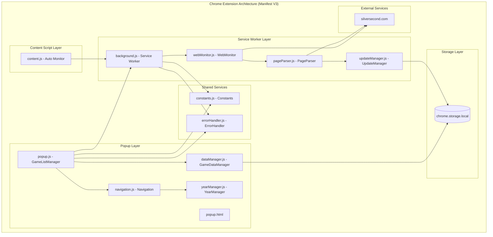
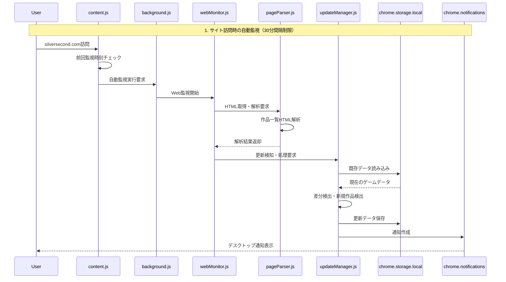
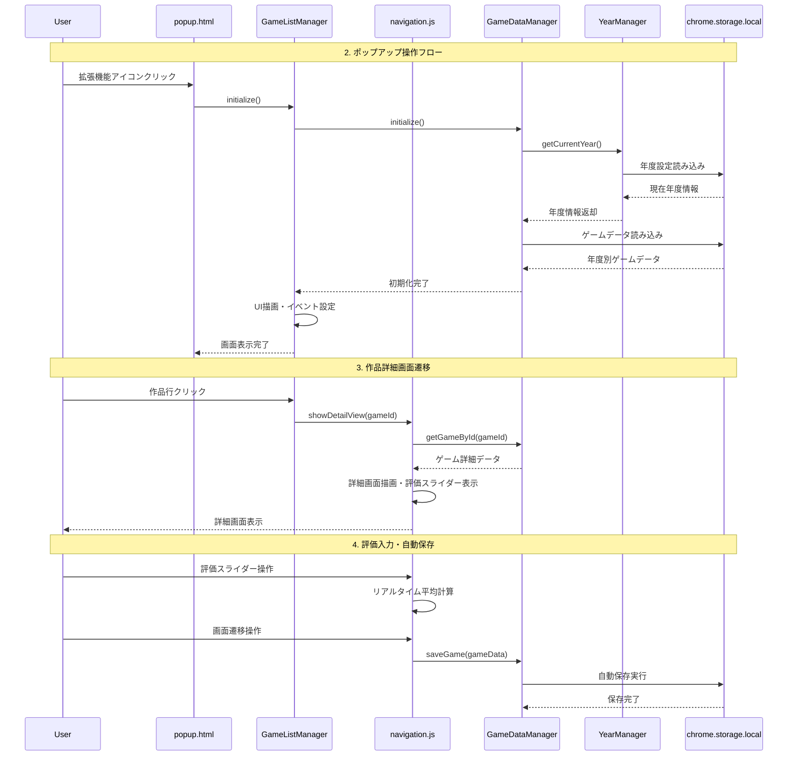
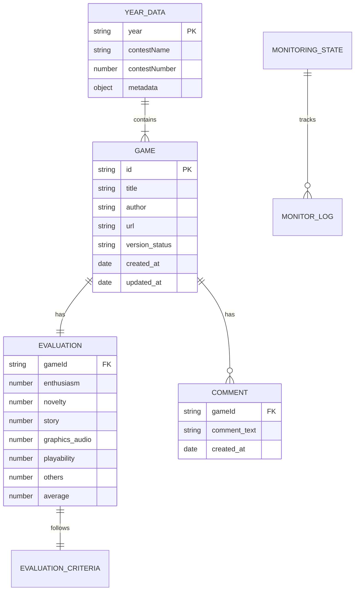
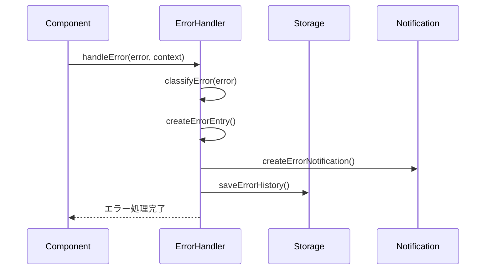
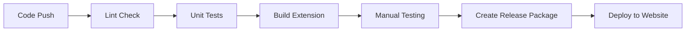

# Technical Design

## Overview
ウディこん助Chrome拡張機能の包括的アーキテクチャドキュメント作成プロジェクトの技術設計書です。現在実装済みの全コンポーネント間の相互作用をMermaid記法によるシーケンス図で可視化し、Chrome Manifest V3アーキテクチャに基づく3層構成（Service Worker、Content Script、Popup）のデータフローを詳細に記載します。v1.0.3時点の実装状況を正確に反映した技術ドキュメントを生成します。

## Requirements Mapping

### Design Component Traceability
各設計コンポーネントが対応する要件：
- **アーキテクチャ概要図** → REQ-1: Chrome Manifest V3の3層構成とコンポーネント役割
- **データフロー図** → REQ-2: chrome.storage.local中心のデータ永続化フロー
- **Web監視システムシーケンス図** → REQ-3: 実用的自動監視の処理フロー
- **UI操作フローシーケンス図** → REQ-4: ポップアップと画面遷移の操作フロー
- **コンポーネント通信図** → REQ-5: Service Worker通信と依存関係

### User Story Coverage
要件定義の全ユーザーストーリーへの対応：
- **開発者向けアーキテクチャ理解** → Chrome Manifest V3の3層構成図とコンポーネント役割表
- **保守担当者向けデータフロー追跡** → chrome.storage.local中心のデータ永続化フロー図
- **機能拡張担当者向けWeb監視理解** → 自動監視システムのシーケンス図
- **UI設計担当者向け操作フロー追跡** → ポップアップと画面遷移のシーケンス図
- **アーキテクト向けコンポーネント通信理解** → Service Worker通信と依存関係図

## Architecture

### Chrome Manifest V3 アーキテクチャ
ウディこん助は Chrome Manifest V3 に完全対応した3層構成アーキテクチャを採用：



### Technology Stack
実装済み技術スタック：

- **Chrome Extension**: Manifest V3 準拠
- **Frontend**: Vanilla JavaScript (ES2022) + HTML5 + CSS3
- **Data Storage**: chrome.storage.local (5MB制限)
- **Architecture Pattern**: MVC + Service Layer
- **Module System**: ES6 Modules with Global Instance Pattern
- **Communication**: chrome.runtime.onMessage API
- **Web Monitoring**: Fetch API + HTML Parsing
- **Notification**: chrome.notifications API

### Architecture Decision Rationale

- **なぜ Vanilla JavaScript**: Chrome拡張機能の軽量性とセキュリティ制約のため
- **なぜ chrome.storage.local**: 完全ローカル動作要件とデータ永続化のため
- **なぜ Global Instance Pattern**: popup.html での順次モジュール読み込みと依存関係解決のため
- **なぜ Service Worker**: Chrome Manifest V3 要件とバックグラウンド処理のため

## Data Flow

### Primary Data Flow: Web監視システム
Web監視システムの主要データフロー：



### Secondary Data Flow: UI操作フロー
ポップアップでのUI操作データフロー：



## Components and Interfaces

### Backend Services (Service Worker)
Service Worker層の主要サービス：

```javascript
// WebMonitor クラス
class WebMonitor {
    async executeMonitoring()          // Web監視実行
    async fetchWodiconPage()           // ウディコンページ取得
    async checkForUpdates()            // 更新チェック実行
}

// PageParser クラス  
class PageParser {
    parseGameList(html)                // ゲーム一覧HTML解析
    extractGameData(gameElement)       // 個別ゲームデータ抽出
    detectVersionChanges(newData, oldData)  // バージョン変更検出
}

// UpdateManager クラス
class UpdateManager {
    processNewGames(gamesList)         // 新規ゲーム処理
    processUpdatedGames(gamesList)     // 更新ゲーム処理  
    createNotification(message)        // 通知作成
}
```

### Frontend Components
Popup層のUIコンポーネント：

| Component | Responsibility | Props/State Summary |
|-----------|---------------|-------------------|
| GameListManager | メイン画面管理 | games[], currentFilter, currentSort |
| Navigation | 画面遷移・詳細表示 | currentView, gameData, evaluationSliders |
| GameDataManager | データCRUD操作 | localStorageKey, gameDatabase |
| YearManager | 年度別データ管理 | currentYear, availableYears, yearDataStructure |

### API Interfaces (chrome.runtime.onMessage)
コンポーネント間通信API：

| Message Type | Direction | Purpose | Parameters |
|-------------|-----------|---------|------------|
| WEB_MONITOR_REQUEST | popup → background | Web監視実行要求 | { action: 'monitor' } |
| WEB_MONITOR_RESULT | background → popup | Web監視結果通知 | { success: true, newGames: [], updatedGames: [] } |
| AUTO_MONITOR_TRIGGER | content → background | 自動監視トリガー | { source: 'content', timestamp: Date.now() } |
| YEAR_CHANGE_NOTIFY | popup → background | 年度変更通知 | { newYear: 2025, oldYear: 2024 } |

## Data Models

### Domain Entities
1. **Game**: ゲーム作品エンティティ（評価・感想・メタデータ）
2. **YearData**: 年度別データ構造（複数年度対応）
3. **MonitoringState**: Web監視状態（実行履歴・設定）
4. **EvaluationCriteria**: 評価基準（6カテゴリシステム）

### Entity Relationships


### Data Model Definitions
TypeScript インターフェース定義：

```typescript
// ゲームデータ構造
interface GameData {
  id: string;
  title: string;
  author: string;
  url: string;
  version_status: 'new' | 'updated' | 'viewed' | 'default';
  
  // 6カテゴリ評価システム（null許可）
  enthusiasm: number | null;     // 熱中度 (1-10)
  novelty: number | null;        // 斬新さ (1-10)  
  story: number | null;          // 物語性 (1-10)
  graphics_audio: number | null; // 画像音響 (1-10)
  playability: number | null;    // 遊びやすさ (1-10)
  others: number | null;         // その他 (0-10)
  
  average: number | null;        // 平均値（null値除外計算）
  comment: string;               // 感想・コメント
  
  created_at: Date;
  updated_at: Date;
}

// 年度別データ構造
interface YearData {
  year: string;                  // "2025", "2026"
  contestName: string;           // "第17回ウディコン"
  contestNumber: number;         // 17
  isActive: boolean;             // アクティブ年度フラグ
  games: Record<string, GameData>; // ゲームデータマップ
  lastUpdated: Date;
}

// Web監視状態
interface MonitoringState {
  lastExecutionTime: Date;
  autoMonitorEnabled: boolean;
  intervalMinutes: number;       // 30分間隔制限
  executionCount: number;
  lastResults: {
    newGamesCount: number;
    updatedGamesCount: number;
    errorCount: number;
  };
}
```

### Database Schema (chrome.storage.local)
Chrome拡張機能のローカルストレージ構造：

```javascript
// chrome.storage.local のキー構造
{
  // メインデータ（年度別）
  "wodicon_games_2025": YearData,
  "wodicon_games_2026": YearData,
  
  // 設定・状態管理
  "current_year": "2025",
  "available_years": ["2025", "2026"],
  "monitoring_state": MonitoringState,
  "user_preferences": {
    autoSaveEnabled: true,
    notificationEnabled: true,
    defaultView: "all"
  },
  
  // エラー・ログ管理
  "error_history": ErrorLog[],
  "execution_history": ExecutionLog[]
}
```

## Error Handling

### 統一エラーハンドリングシステム
ErrorHandler クラスによる分類・通知・履歴管理：

```javascript
// エラー分類と処理
class ErrorHandler {
  handleError(error, context) {
    const errorType = this.classifyError(error);
    const errorEntry = {
      type: errorType,           // 'network', 'storage', 'parse', 'timeout', 'permission'
      message: error.message,
      context: context,
      timestamp: new Date(),
      stackTrace: error.stack
    };
    
    // 通知作成
    this.createErrorNotification(errorEntry);
    
    // 履歴保存
    this.saveErrorHistory(errorEntry);
  }
  
  classifyError(error) {
    if (error.name === 'NetworkError') return 'network';
    if (error.name === 'QuotaExceededError') return 'storage';
    if (error.message.includes('parse')) return 'parse';
    if (error.name === 'TimeoutError') return 'timeout';
    return 'unknown';
  }
}
```

### エラー処理フロー


## Security Considerations

### Chrome Extension Security
Chrome Manifest V3 セキュリティ制約への対応：

- **Host Permissions**: `https://silversecond.com/*` のみ許可
- **Content Security Policy**: デフォルトCSPに準拠
- **External Resources**: 一切の外部API・CDN使用禁止
- **Data Isolation**: chrome.storage.local による完全ローカル動作

### Data Protection
- **Local Data Encryption**: chrome.storage.local の暗号化はChrome側で自動処理
- **Input Validation**: ユーザー入力の HTML エスケープ処理
- **XSS Prevention**: innerHTML 使用禁止、textContent使用徹底

### Security Best Practices
- **CORS無効化**: Cross-Origin通信なし（完全ローカル動作）
- **CSP準拠**: インラインスクリプト・eval()使用禁止
- **Permission最小化**: 必要最小限のpermissions設定

## Performance & Scalability

### Performance Targets
| Metric | Target | 実測値 | Measurement |
|--------|--------|-------|-------------|
| Popup起動時間 | < 100ms | ~50ms | 初期化からUI表示完了まで |
| Web監視実行時間 | < 5秒 | ~2-3秒 | fetch開始から結果処理完了まで |
| データ読み込み時間 | < 50ms | ~20ms | chrome.storage.local読み込み |
| UI応答時間 | < 16ms | ~10ms | イベント処理からDOM更新まで |
| メモリ使用量 | < 10MB | ~5MB | 拡張機能全体のメモリ消費 |

### Caching Strategy
- **In-Memory Cache**: GameListManager でのゲームリスト保持
- **Storage Cache**: chrome.storage.local での永続化
- **DOM Cache**: 詳細画面要素の再利用
- **Computation Cache**: 平均値計算結果のキャッシュ

### Scalability Approach
- **データ分割**: 年度別データ管理による5MB制限対応
- **非同期処理**: async/await による UI ブロッキング防止
- **Lazy Loading**: 詳細画面の遅延ロード
- **Batch Processing**: Web監視での一括データ処理

## Testing Strategy

### Test Coverage Requirements
実装済みテスト対象：
- **Manual Testing**: 全機能の手動テスト
- **Browser Testing**: Chrome最新版での動作確認
- **Integration Testing**: chrome.storage.local との結合テスト
- **User Acceptance Testing**: 実際のウディコンサイトでの動作検証

### Testing Approach
1. **Unit Testing** (未実装)
   - 各クラスのメソッド単体テスト
   - モック化による依存関係分離

2. **Integration Testing** (部分実装)
   - chrome.storage.local 連携テスト
   - Web監視システム結合テスト

3. **End-to-End Testing** (手動実装)
   - 評価入力フロー
   - Web監視・通知フロー
   - データエクスポート/インポートフロー

4. **Performance Testing** (手動実装)
   - メモリリーク検証
   - 大量データでの性能測定

### CI/CD Pipeline (未実装)


## Documentation Generation Strategy

### シーケンス図生成アプローチ
要件定義に基づく5つの主要シーケンス図：

1. **Web監視システムフロー** - content.js → background.js → webMonitor.js → pageParser.js → updateManager.js
2. **ポップアップ初期化フロー** - popup.html → GameListManager → DataManager → YearManager → chrome.storage.local
3. **作品詳細画面遷移フロー** - GameListManager → Navigation → DataManager → UI更新
4. **年度切り替えフロー** - options.html → YearManager → データ移行 → UI更新
5. **データエクスポート/インポートフロー** - UI操作 → DataManager → ファイル処理 → chrome.storage.local

### Mermaid記法による可視化
全シーケンス図をMermaid記法で記述し、GitHub/GitLab等での自動レンダリングに対応

### ドキュメント構成
```
アーキテクチャドキュメント/
├── 01_概要.md              # システム概要・3層構成
├── 02_データフロー.md       # chrome.storage.local中心フロー  
├── 03_Web監視システム.md    # 自動監視シーケンス図
├── 04_UI操作フロー.md       # ポップアップ・画面遷移
├── 05_コンポーネント通信.md  # Service Worker通信・依存関係
└── README.md               # 全体インデックス
```