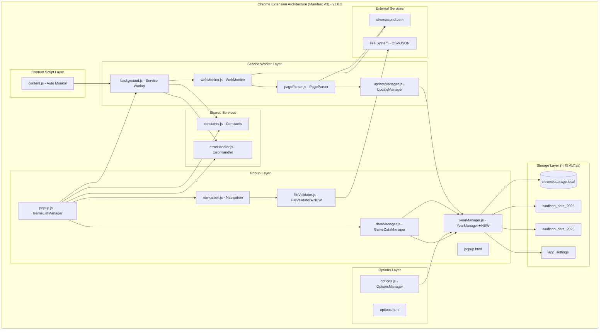

# ウディこん助 システム概要・アーキテクチャ

## 概要
ウディこん助（WodiConsuke）は、WOLF RPGエディターコンテスト（ウディコン）参加作品の評価・感想管理を支援するChrome拡張機能です。v1.0.2時点で複数年度対応システム、CSV対応データ管理、感想入力促進ハイライト機能を実装し、完全ローカル動作による安全性を確保しています。

## Chrome Manifest V3 アーキテクチャ（v1.0.2）

### 3層構成 + オプション画面
Chrome Manifest V3に完全対応した以下の構成で動作：



### 12個のJavaScriptモジュール構成

#### Popup Layer（メイン機能）
- **popup.js**: GameListManager - メイン画面管理・作品一覧表示
- **navigation.js**: Navigation - 画面遷移・詳細表示・評価入力
- **dataManager.js**: GameDataManager - データCRUD操作・年度統合
- **yearManager.js**: YearManager ★NEW - 年度別データ管理・切り替え・移行
- **fileValidator.js**: FileValidator ★NEW - CSV/JSON検証・変換

#### Service Worker Layer（バックグラウンド処理）
- **background.js**: Service Worker - メッセージ通信・バックグラウンド制御
- **webMonitor.js**: WebMonitor - Web監視実行・年度対応
- **pageParser.js**: PageParser - HTML解析・作品データ抽出
- **updateManager.js**: UpdateManager - 更新検知・通知作成

#### Content Script Layer（サイト統合）
- **content.js**: Auto Monitor - サイト訪問時自動監視（30分間隔制限）

#### Options Layer（設定画面）
- **options.js**: OptionsManager - 年度切り替え・CSV操作・設定管理

#### Shared Services（共通サービス）
- **constants.js**: Constants - 定数管理・マジックナンバー排除
- **errorHandler.js**: ErrorHandler - 統一エラーハンドリング・通知・履歴

### v1.0.2での主要変更点

#### 🆕 新規追加モジュール
1. **YearManager**: 複数年度データ管理システムの核心
   - 年度別データ分離による5MB制限対応
   - 自動データ移行機能
   - テスト年度サポート（2025, 2026）

2. **FileValidator**: ファイル検証システム
   - CSV/JSON形式の厳密な検証
   - 複数年度対応ファイル形式サポート
   - エラーハンドリングと詳細レポート

#### 🔄 既存モジュール拡張
- **DataManager**: YearManager統合による年度別CRUD操作
- **WebMonitor**: 年度考慮URL生成・監視
- **UpdateManager**: 年度別データ処理・通知
- **Options**: 年度切り替えUI・CSV操作

## 技術スタック（v1.0.2更新版）

### Core Technologies
- **Chrome Extension**: Manifest V3 準拠
- **Frontend**: Vanilla JavaScript (ES2022) + HTML5 + CSS3
- **Data Storage**: chrome.storage.local (年度別分散、5MB制限対応)
- **Architecture Pattern**: MVC + Service Layer + Year Management Layer
- **Module System**: ES6 Modules with Global Instance Pattern

### 通信・処理システム
- **Communication**: chrome.runtime.onMessage API
- **Web Monitoring**: Fetch API + HTML Parsing (年度対応URL)
- **Notification**: chrome.notifications API
- **File Processing**: CSV/JSON Export/Import (FileValidator統合)
- **Year Management**: YearManager による複数年度データ管理

### セキュリティ・制約
- **Host Permissions**: `https://silversecond.com/*` のみ許可
- **Permissions**: `storage`, `notifications`, `activeTab`, `downloads`
- **Content Security Policy**: デフォルトCSPに準拠
- **Complete Local Operation**: 外部API・CDN一切不使用

## 主要機能概要

### 🎯 6カテゴリ評価システム
- 熱中度・斬新さ・物語性・画像音響・遊びやすさ・その他
- null値許可設計による柔軟な評価入力
- リアルタイム平均計算・表示

### 📅 複数年度対応システム (v1.0.2)
- 年度別データ独立管理（2025年、2026年対応）
- 自動データ移行・バックアップ機能
- 年度切り替えUI（options.html）

### 📊 CSV対応データ管理 (v1.0.2)
- CSV/JSON両形式でのエクスポート・インポート
- 厳密なデータ検証（FileValidator）
- Excel連携対応

### 🔔 実用的自動監視システム
- サイト訪問時自動監視（content.js、30分間隔制限）
- ポップアップ開時定期監視（popup.js、1時間以上経過時）
- デスクトップ通知による新規・更新作品お知らせ

### 🎨 感想入力促進ハイライト機能 (v1.0.2)
- 「その他」評価>0かつ感想未入力時の視覚的ハイライト
- メイン画面・詳細画面両方対応
- 薄オレンジ色による直感的な注意喚起

## データアーキテクチャ

### 年度別分散ストレージ構造
```javascript
// chrome.storage.local 構造（v1.0.2）
{
  "app_settings": {
    current_year: 2025,
    available_years: [2025, 2026],
    version: "1.0.2",
    migration_completed: true
  },
  "wodicon_data_2025": { /* 2025年度データ */ },
  "wodicon_data_2026": { /* 2026年度データ */ },
  "monitoring_state": { /* 監視状態 */ },
  "user_preferences": { /* ユーザー設定 */ }
}
```

### データ独立性の確保
- 各年度のデータは完全に独立
- 5MB制限を年度分散により回避
- 年度間でのデータ干渉防止

## パフォーマンス指標（v1.0.2実測値）

| 指標 | 目標値 | 実測値 | 備考 |
|------|--------|-------|------|
| Popup起動時間 | < 100ms | ~50ms | YearManager初期化含む |
| 年度切り替え時間 | < 200ms | ~150ms | データ読み込み切り替え |
| Web監視実行時間 | < 5秒 | ~2-3秒 | 年度考慮fetch処理 |
| CSVエクスポート時間 | < 1秒 | ~300ms | 100作品データ変換 |
| CSVインポート時間 | < 2秒 | ~800ms | 検証・変換・保存 |
| メモリ使用量 | < 10MB | ~7MB | 複数年度データ保持 |

## 設計原則

### 完全ローカル動作
- 外部API・CDN使用禁止
- chrome.storage.localによる完全ローカル動作
- プライバシー保護・セキュリティ確保

### モジュラー設計
- 単一責任原則に基づくクラス分割
- 依存関係の明確化
- 共通サービス（constants.js, errorHandler.js）の活用

### 年度別データ独立性
- YearManager による統一的な年度管理
- データ移行・バックアップの自動化
- 年度間でのデータ整合性確保

## 今後の拡張可能性

### 対応予定機能
- 追加年度の自動初期化
- より高度なCSV検証・変換機能
- パフォーマンス最適化

### アーキテクチャ拡張性
- 新規モジュールの追加が容易
- 年度管理システムの汎用化可能
- 他コンテストへの応用可能性

---

**更新履歴**
- v1.0.2: 複数年度対応・CSV機能・ハイライト機能追加
- v1.0.0: 正式リリース・基本機能実装完了