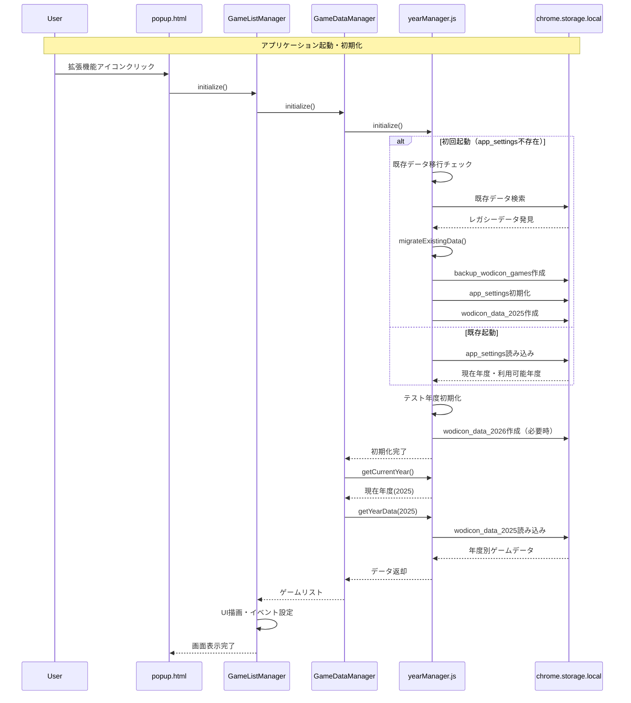
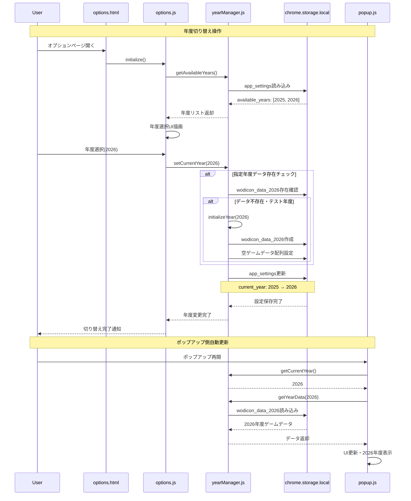
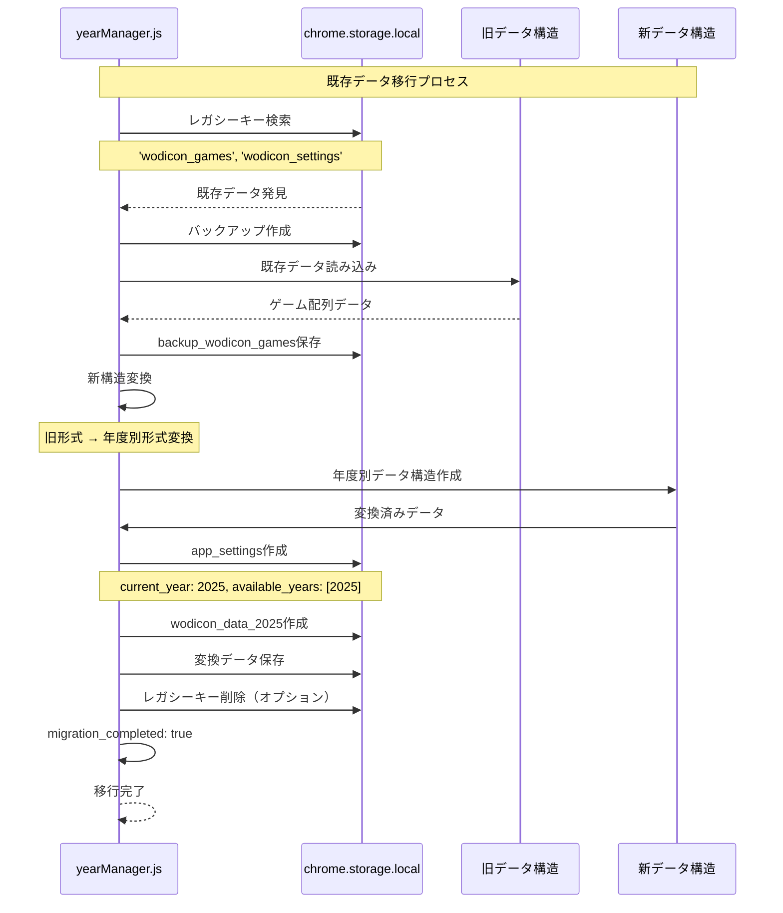
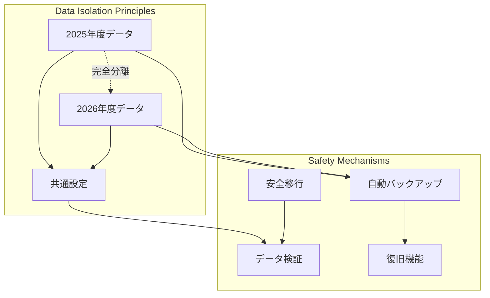

# 年度別データフロー・管理システム

## 概要
ウディこん助v1.0.2で導入された複数年度対応システムは、YearManagerを中心とした年度別データ管理により、chrome.storage.localの5MB制限を回避し、年度ごとに独立したデータ管理を実現しています。

## YearManager中心のデータ管理アーキテクチャ

### 年度別ストレージ構造
```mermaid
graph TB
    subgraph "chrome.storage.local Structure (v1.0.2)"
        AppSettings[app_settings]
        YearData2025[wodicon_data_2025]
        YearData2026[wodicon_data_2026]
        MonitoringState[monitoring_state]
        UserPrefs[user_preferences]
        ErrorHistory[error_history]
        BackupData[backup_wodicon_games]
    end
    
    subgraph "YearManager Operations"
        YearMgr[yearManager.js]
        GetCurrentYear[getCurrentYear()]
        SetCurrentYear[setCurrentYear()]
        GetYearData[getYearData()]
        SetYearData[setYearData()]
        MigrateData[migrateExistingData()]
    end
    
    YearMgr --> AppSettings
    YearMgr --> YearData2025
    YearMgr --> YearData2026
    YearMgr --> BackupData
    
    GetCurrentYear --> AppSettings
    SetCurrentYear --> AppSettings
    GetYearData --> YearData2025
    GetYearData --> YearData2026
    SetYearData --> YearData2025
    SetYearData --> YearData2026
    MigrateData --> BackupData
```

## 主要データフロー

### 1. アプリケーション初期化フロー


### 2. 年度切り替えフロー


### 3. データ移行・バックアップフロー


## 年度別データ構造詳細

### AppSettings構造
```typescript
interface AppSettings {
  current_year: number;                  // 現在選択年度: 2025
  available_years: number[];             // 利用可能年度: [2025, 2026]
  version: string;                       // アプリバージョン: "1.0.2"
  last_updated: Date;                    // 最終更新日時
  migration_completed: boolean;          // 移行完了フラグ
  test_mode: boolean;                    // テストモード（開発用）
}
```

### YearData構造
```typescript
interface YearData {
  year: number;                          // 年度: 2025, 2026
  contestName: string;                   // コンテスト名: "第17回ウディコン"
  contestNumber: number;                 // 回数: 17, 18
  isActive: boolean;                     // アクティブ年度フラグ
  games: GameData[];                     // ゲームデータ配列
  settings: {                            // 年度別設定
    default_sort: string;
    default_filter: string;
    notifications_enabled: boolean;
  };
  metadata: {                            // 年度別メタデータ
    total_games: number;
    last_web_monitor: Date;
    storage_usage: number;
  };
  lastUpdated: Date;                     // 最終更新日時
}
```

## データ整合性・安全性

### 年度データ独立性の確保


### エラーハンドリング・復旧
1. **データ破損検出**: 年度データ読み込み時の自動検証
2. **自動復旧**: バックアップからの自動復旧機能
3. **部分復旧**: 年度別独立性による影響範囲限定
4. **ログ記録**: 移行・操作履歴の詳細記録

## パフォーマンス最適化

### メモリ効率化
- **遅延読み込み**: 非アクティブ年度データの遅延読み込み
- **キャッシュ戦略**: 現在年度データのメモリ保持
- **ガベージコレクション**: 未使用年度データの自動開放

### ストレージ効率化
- **データ圧縮**: 年度別データの効率的な格納
- **重複排除**: 共通設定の統一管理
- **容量監視**: 年度別容量使用量の追跡

## 今後の拡張性

### 新年度自動対応
```javascript
// 年度自動初期化機能（将来実装予定）
class YearManager {
  async autoInitializeNewYear() {
    const currentYear = new Date().getFullYear();
    const availableYears = await this.getAvailableYears();
    
    if (!availableYears.includes(currentYear)) {
      await this.initializeYear(currentYear);
      await this.setCurrentYear(currentYear);
    }
  }
}
```

### 年度間データ連携
- 作品評価の年度横断的分析
- 評価傾向の年度比較機能
- 長期統計データの提供

---

**技術仕様**
- 最大対応年度数: 制限なし（ストレージ容量依存）
- 年度切り替え時間: ~150ms
- データ移行時間: ~500ms（100作品程度）
- 安全性: 年度別完全分離・自動バックアップ