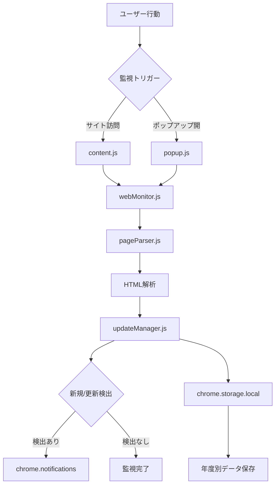
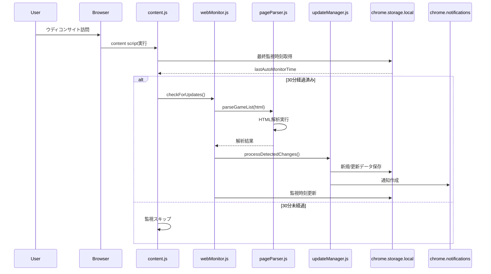
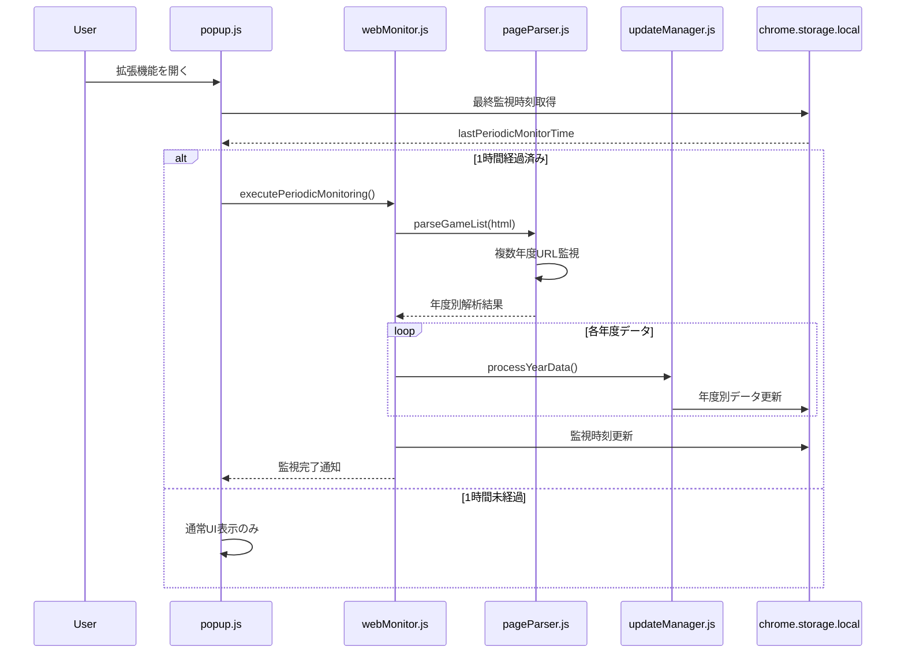
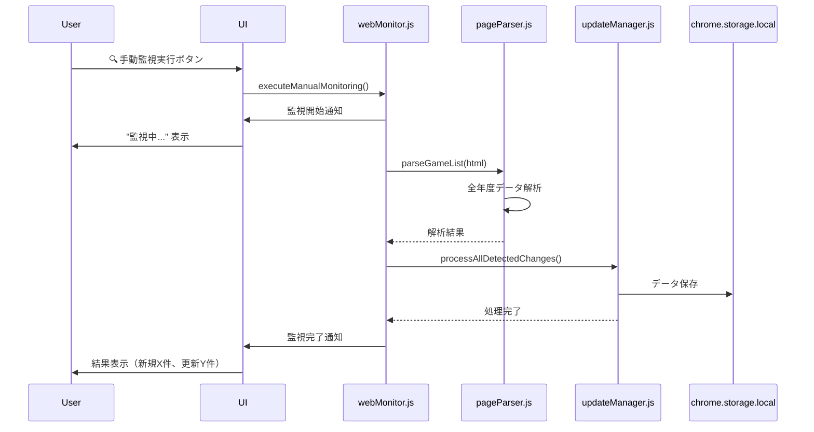

# Web監視システム

## 概要

ウディこん助のWeb監視システムは、Chrome Manifest V3制約に対応した実用的自動監視システムです。従来のbackground.js定期監視に代わり、Content Script（サイト訪問時）とPopup（拡張機能開時）での監視を実現しています。

## アーキテクチャ

### システム構成


### 監視実行条件

#### Content Script監視（content.js）
- **トリガー**: silversecond.comサイト訪問時
- **頻度制限**: 30分間隔（重複実行防止）
- **対象**: ウディコンサイト全ページ
- **実行タイミング**: ページロード完了後

#### Popup監視（popup.js）
- **トリガー**: 拡張機能ポップアップ開時
- **頻度制限**: 1時間間隔（定期監視）
- **対象**: 拡張機能利用時の能動的監視
- **実行タイミング**: ポップアップUI初期化後

## シーケンス図

### 1. Content Script自動監視フロー



### 2. Popup定期監視フロー



### 3. 手動監視実行フロー



## 主要コンポーネント詳細

### webMonitor.js
**役割**: Web監視の実行制御と結果処理
```javascript
class WebMonitor {
    // 自動監視（Content Script用）
    async checkForUpdates() {
        const shouldMonitor = await this.shouldExecuteAutoMonitor();
        if (!shouldMonitor) return;
        
        await this.executeMonitoring('auto');
    }
    
    // 定期監視（Popup用）
    async executePeriodicMonitoring() {
        const shouldMonitor = await this.shouldExecutePeriodicMonitor();
        if (!shouldMonitor) return;
        
        await this.executeMonitoring('periodic');
    }
    
    // 手動監視
    async executeManualMonitoring() {
        await this.executeMonitoring('manual');
    }
}
```

### pageParser.js
**役割**: HTML解析と差分検出
```javascript
class PageParser {
    // 作品一覧HTML解析
    async parseGameList(html) {
        const parser = new DOMParser();
        const doc = parser.parseFromString(html, 'text/html');
        
        // 作品情報抽出
        const gameElements = doc.querySelectorAll('.game-item');
        const games = Array.from(gameElements).map(this.extractGameData);
        
        return games;
    }
    
    // 差分検出
    async detectChanges(newGames, existingGames) {
        const newItems = [];
        const updatedItems = [];
        
        // 新規・更新判定ロジック
        // ...
        
        return { newItems, updatedItems };
    }
}
```

### updateManager.js
**役割**: 検出結果の処理と通知
```javascript
class UpdateManager {
    // 統一データ処理
    async processDetectedChanges(changes) {
        const { newItems, updatedItems } = changes;
        
        // 新規作品処理
        for (const item of newItems) {
            await this.processNewGame(item);
        }
        
        // 更新作品処理
        for (const item of updatedItems) {
            await this.processUpdatedGame(item);
        }
        
        // 通知作成
        await this.createNotifications(newItems, updatedItems);
    }
}
```

## 監視対象URL

### 複数年度対応
```javascript
const MONITORING_URLS = {
    2025: 'https://silversecond.com/WolfRPGEditor/Contest/2025/',
    2026: 'https://silversecond.com/WolfRPGEditor/Contest/2026/',
    // 将来年度の自動追加
};
```

### URL構造解析
- **作品一覧**: `/Contest/[年度]/`
- **個別作品**: `/Contest/[年度]/[作品ID]/`
- **更新情報**: HTML内のタイムスタンプ解析

## エラーハンドリング

### ネットワークエラー対応
```javascript
class WebMonitor {
    async executeMonitoring(type) {
        try {
            const response = await fetch(url, { timeout: 10000 });
            // 監視処理
        } catch (error) {
            window.errorHandler.handleError(error, 'web-monitoring', {
                monitoringType: type,
                url: url
            });
        }
    }
}
```

### タイムアウト制御
- **fetch timeout**: 10秒
- **HTML解析 timeout**: 5秒
- **総監視時間**: 30秒以内

### 失敗時の動作
1. **リトライ**: 最大3回、指数バックオフ
2. **ログ記録**: errorHandler.jsで統一管理
3. **ユーザー通知**: 重要エラーのみ通知

## パフォーマンス最適化

### メモリ管理
- DOM Parserの適切な破棄
- 大量データの分割処理
- 不要なデータの即座削除

### ネットワーク最適化
- 条件付きリクエスト（If-Modified-Since）
- 必要最小限のHTML取得
- 並列処理の制限（最大3並列）

### ストレージ最適化
- 差分更新のみ実行
- 年度別データ分離
- 古いデータの自動削除

## 設定・状態管理

### 監視設定
```javascript
const MONITORING_CONFIG = {
    AUTO_MONITOR_INTERVAL: 30 * 60 * 1000,     // 30分
    PERIODIC_MONITOR_INTERVAL: 60 * 60 * 1000,  // 1時間
    MAX_RETRY_COUNT: 3,
    TIMEOUT_MS: 10000
};
```

### 状態追跡
- `lastAutoMonitorTime`: 最終自動監視時刻
- `lastPeriodicMonitorTime`: 最終定期監視時刻
- `monitoringHistory`: 監視履歴（最新100件）
- `errorHistory`: エラー履歴（最新50件）

## 今後の拡張予定

### 監視機能強化
- RSS/Atom対応（サイト提供時）
- WebSocket監視（リアルタイム更新）
- Push通知との連携

### パフォーマンス改善
- Service Workerでのバックグラウンド処理
- IndexedDBへの移行検討
- 機械学習による更新予測