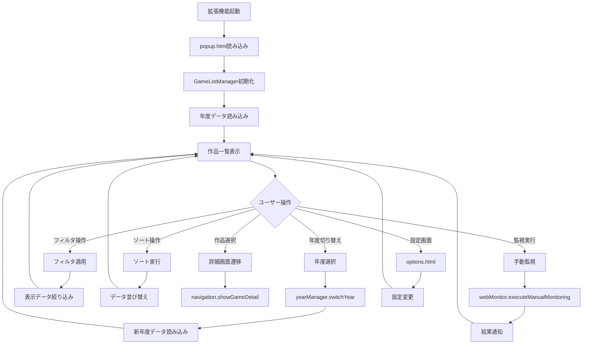
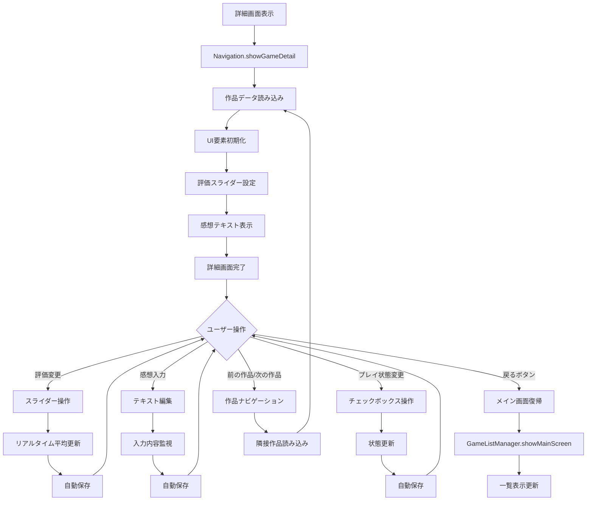
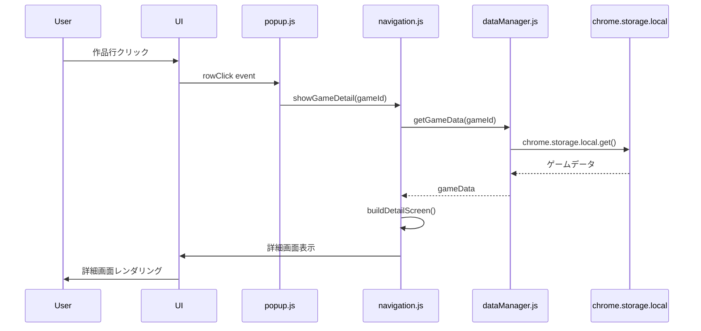
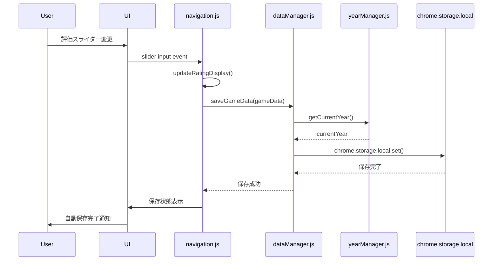
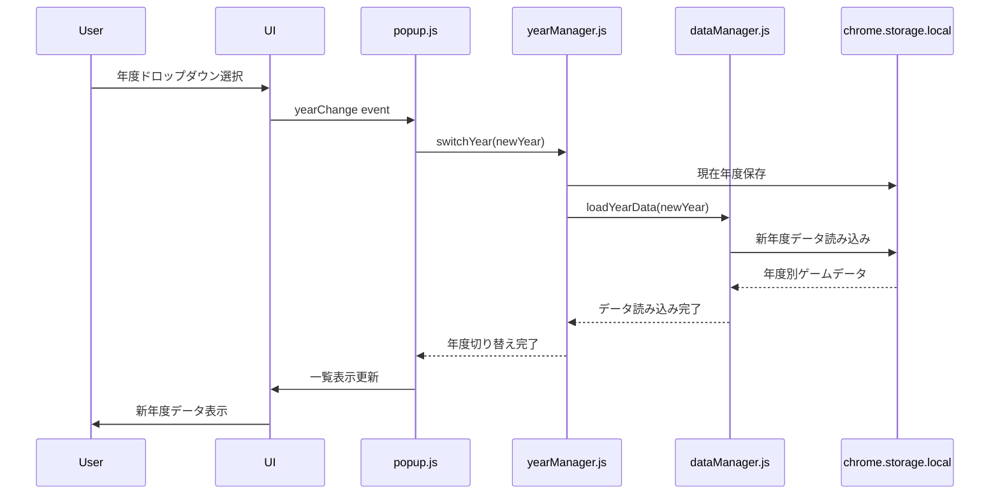

# UI操作フロー

## 概要

ウディこん助のUIは、Single Page Application（SPA）アーキテクチャを採用し、popup.htmlを基盤とした直感的な作品管理インターフェースを提供します。メイン画面（一覧表示）と詳細画面（個別評価）の2画面構成で、シームレスな操作体験を実現しています。

## 画面構成

### メイン画面（popup.js）
- **作品一覧表示**: テーブル形式での作品リスト
- **年度切り替え**: ドロップダウンでの年度選択
- **フィルタリング**: 未プレイ/新着/更新作品の絞り込み
- **ソート機能**: 各列での昇順/降順並び替え
- **監視機能**: 手動監視・状態確認ボタン

### 詳細画面（navigation.js）
- **6カテゴリ評価**: スライダーでの直感的評価入力
- **感想記録**: テキストエリアでの詳細感想入力
- **プレイ状態管理**: チェックボックスでの完了状態
- **作品情報表示**: タイトル・作者・更新日の表示

## UI操作フローチャート

### 1. メイン画面操作フロー



### 2. 詳細画面操作フロー



## コンポーネント間相互作用

### 1. 画面遷移シーケンス



### 2. データ保存シーケンス



### 3. 年度切り替えシーケンス



## UI要素詳細

### メイン画面テーブル
```javascript
// テーブル構造
const TABLE_COLUMNS = [
    { id: 'no', title: 'No', sortable: true, clickable: true },
    { id: 'title', title: '作品名', sortable: true, clickable: true },
    { id: 'author', title: '作者', sortable: true, clickable: false },
    { id: 'updated', title: '更新', sortable: true, clickable: true },
    { id: 'heat', title: '熱', sortable: true, clickable: true },
    { id: 'novelty', title: '斬', sortable: true, clickable: true },
    { id: 'story', title: '物', sortable: true, clickable: true },
    { id: 'graphics', title: '画', sortable: true, clickable: true },
    { id: 'playability', title: '遊', sortable: true, clickable: true },
    { id: 'other', title: '他', sortable: true, clickable: true }
];
```

### 詳細画面評価スライダー
```javascript
// スライダー設定
const RATING_SLIDERS = [
    { id: 'heat', label: '熱中度', range: '1-10', color: '#ff6b6b' },
    { id: 'novelty', label: '斬新さ', range: '1-10', color: '#4ecdc4' },
    { id: 'story', label: '物語性', range: '1-10', color: '#45b7d1' },
    { id: 'graphics', label: '画像音響', range: '1-10', color: '#96ceb4' },
    { id: 'playability', label: '遊びやすさ', range: '1-10', color: '#feca57' },
    { id: 'other', label: 'その他', range: '0-10', color: '#ff9ff3' }
];
```

## イベントハンドリング

### 1. クリックイベント処理
```javascript
class GameListManager {
    setupEventListeners() {
        // テーブル行クリック
        document.addEventListener('click', (e) => {
            if (e.target.closest('.game-row')) {
                const gameId = e.target.closest('.game-row').dataset.gameId;
                window.navigation.showGameDetail(gameId);
            }
        });
        
        // ソートヘッダークリック
        document.addEventListener('click', (e) => {
            if (e.target.classList.contains('sortable-header')) {
                this.handleSort(e.target.dataset.column);
            }
        });
    }
}
```

### 2. 入力イベント処理
```javascript
class Navigation {
    setupDetailEventListeners() {
        // 評価スライダー
        document.addEventListener('input', (e) => {
            if (e.target.classList.contains('rating-slider')) {
                this.handleRatingChange(e.target);
            }
        });
        
        // 感想テキスト
        document.addEventListener('input', (e) => {
            if (e.target.id === 'impressions-text') {
                this.handleImpressionsChange(e.target);
            }
        });
    }
}
```

### 3. キーボードショートカット
```javascript
// キーボード操作サポート
document.addEventListener('keydown', (e) => {
    if (window.navigation.isDetailScreen) {
        switch (e.key) {
            case 'Escape':
                window.navigation.showMainScreen();
                break;
            case 'ArrowLeft':
                if (e.ctrlKey) window.navigation.showPreviousGame();
                break;
            case 'ArrowRight':
                if (e.ctrlKey) window.navigation.showNextGame();
                break;
        }
    }
});
```

## レスポンシブ対応

### ポップアップサイズ調整
```css
/* popup.css */
body {
    width: 800px;
    min-height: 600px;
    max-height: 700px;
    overflow: auto;
}

.main-container {
    display: flex;
    flex-direction: column;
    height: 100%;
}

@media (max-width: 900px) {
    body {
        width: 750px;
    }
}
```

### テーブル表示最適化
```css
.game-table {
    width: 100%;
    border-collapse: collapse;
    table-layout: fixed;
}

.game-table th,
.game-table td {
    padding: 8px;
    text-align: center;
    border: 1px solid #ddd;
    overflow: hidden;
    text-overflow: ellipsis;
    white-space: nowrap;
}
```

## アニメーション・視覚効果

### 画面遷移アニメーション
```css
.screen-transition {
    transition: opacity 0.3s ease-in-out, transform 0.3s ease-in-out;
}

.screen-enter {
    opacity: 0;
    transform: translateX(20px);
}

.screen-enter-active {
    opacity: 1;
    transform: translateX(0);
}
```

### ホバー効果
```css
.game-row:hover {
    background-color: #f0f8ff;
    cursor: pointer;
    transition: background-color 0.2s ease;
}

.rating-slider:hover {
    filter: brightness(1.1);
}
```

### 新着・更新表示
```css
.new-badge {
    background: linear-gradient(45deg, #ff6b6b, #ee5a24);
    color: white;
    padding: 2px 6px;
    border-radius: 4px;
    font-size: 10px;
    animation: pulse 2s infinite;
}

@keyframes pulse {
    0% { opacity: 1; }
    50% { opacity: 0.7; }
    100% { opacity: 1; }
}
```

## アクセシビリティ対応

### キーボードナビゲーション
```javascript
// Tab順序の最適化
const focusableElements = document.querySelectorAll(
    'button, [href], input, select, textarea, [tabindex]:not([tabindex="-1"])'
);

// ARIA属性の設定
element.setAttribute('aria-label', '作品詳細を表示');
element.setAttribute('role', 'button');
```

### スクリーンリーダー対応
```html
<!-- セマンティックHTML -->
<table role="table" aria-label="作品一覧">
    <thead>
        <tr role="row">
            <th role="columnheader" aria-sort="none">作品名</th>
        </tr>
    </thead>
</table>

<!-- 状態の読み上げ -->
<div aria-live="polite" id="status-message"></div>
```

## パフォーマンス最適化

### 仮想スクロール（将来対応）
```javascript
// 大量データ対応の仮想スクロール実装予定
class VirtualScrollTable {
    constructor(data, rowHeight = 30) {
        this.data = data;
        this.rowHeight = rowHeight;
        this.visibleRows = Math.ceil(window.innerHeight / rowHeight) + 5;
    }
}
```

### 遅延レンダリング
```javascript
// 大きなテーブルの段階的レンダリング
renderTableRows(games, startIndex = 0, batchSize = 50) {
    const endIndex = Math.min(startIndex + batchSize, games.length);
    const fragment = document.createDocumentFragment();
    
    for (let i = startIndex; i < endIndex; i++) {
        fragment.appendChild(this.createGameRow(games[i]));
    }
    
    return fragment;
}
```

## エラー状態の表示

### ローディング状態
```html
<div class="loading-overlay">
    <div class="spinner"></div>
    <p>データ読み込み中...</p>
</div>
```

### エラー状態
```html
<div class="error-state">
    <h3>データの読み込みに失敗しました</h3>
    <p>もう一度お試しください</p>
    <button onclick="location.reload()">再読み込み</button>
</div>
```

### 空状態
```html
<div class="empty-state">
    <h3>作品データがありません</h3>
    <p>Web監視を実行して作品データを取得してください</p>
    <button onclick="window.webMonitor.executeManualMonitoring()">
        監視実行
    </button>
</div>
```