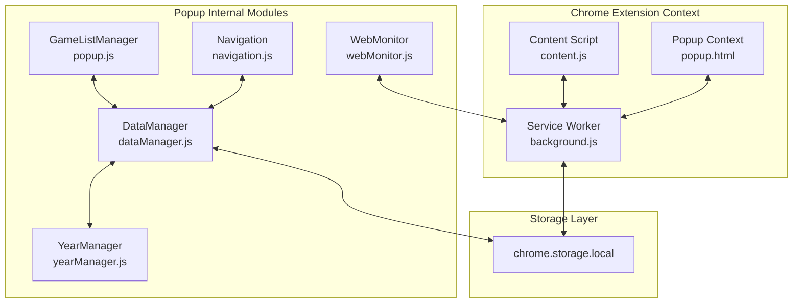
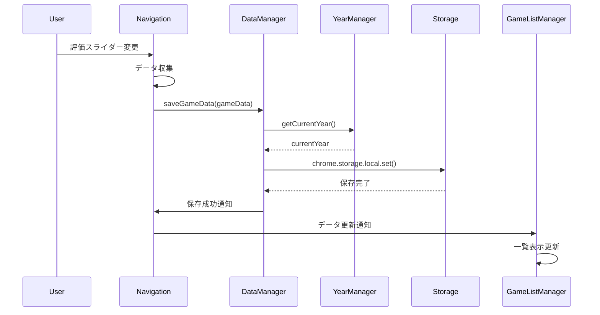
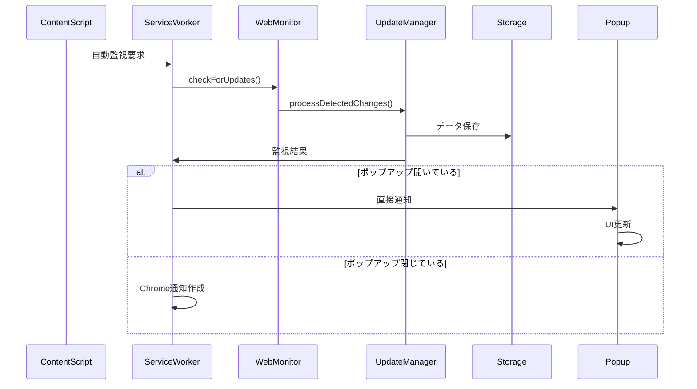
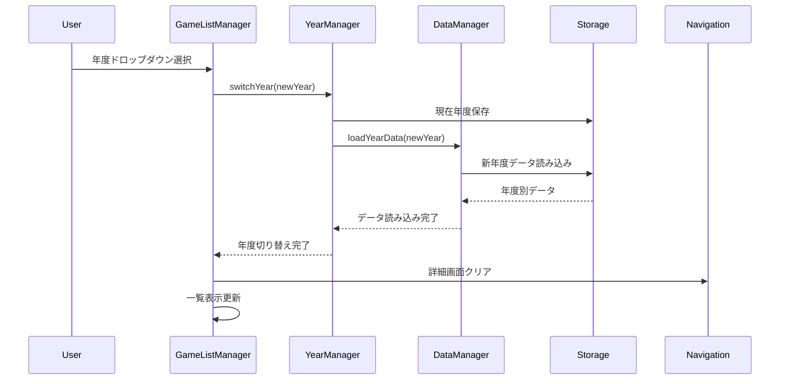

# コンポーネント通信

## 概要

ウディこん助のコンポーネント通信システムは、Chrome Manifest V3制約下でのService Worker、Content Script、Popupの3層間通信と、Popup内でのモジュール間通信を統合的に管理します。完全ローカル動作を維持しながら、効率的なデータ流通を実現しています。

## アーキテクチャ概要

### 通信レイヤー構成


## Chrome拡張機能間通信

### 1. Service Worker ↔ Content Script通信

#### メッセージ送信（Content Script → Service Worker）
```javascript
// content.js
class ContentScript {
    async sendMonitoringRequest() {
        try {
            const response = await chrome.runtime.sendMessage({
                type: 'AUTO_MONITOR_REQUEST',
                timestamp: Date.now(),
                url: window.location.href
            });
            
            if (response.success) {
                console.log('自動監視完了');
            }
        } catch (error) {
            console.error('Service Worker通信エラー:', error);
        }
    }
}
```

#### メッセージ受信（Service Worker）
```javascript
// background.js
chrome.runtime.onMessage.addListener((message, sender, sendResponse) => {
    switch (message.type) {
        case 'AUTO_MONITOR_REQUEST':
            handleAutoMonitorRequest(message, sender)
                .then(result => sendResponse(result))
                .catch(error => sendResponse({ success: false, error: error.message }));
            return true; // 非同期レスポンス用
            
        case 'MANUAL_MONITOR_REQUEST':
            handleManualMonitorRequest(message)
                .then(result => sendResponse(result))
                .catch(error => sendResponse({ success: false, error: error.message }));
            return true;
    }
});
```

### 2. Service Worker ↔ Popup通信

#### ポップアップからの監視要求
```javascript
// popup.js (GameListManager)
class GameListManager {
    async executeManualMonitoring() {
        this.updateMonitorButton('monitoring');
        
        try {
            const response = await chrome.runtime.sendMessage({
                type: 'MANUAL_MONITOR_REQUEST',
                userId: 'popup',
                timestamp: Date.now()
            });
            
            if (response.success) {
                this.handleMonitoringSuccess(response.data);
            } else {
                this.handleMonitoringError(response.error);
            }
        } catch (error) {
            window.errorHandler.handleError(error, 'popup-service-worker-communication');
        } finally {
            this.updateMonitorButton('idle');
        }
    }
}
```

#### Service Workerからの通知
```javascript
// background.js
async function notifyPopup(data) {
    try {
        // ポップアップが開いているかチェック
        const views = chrome.extension.getViews({ type: 'popup' });
        if (views.length > 0) {
            // ポップアップに直接通知
            views[0].window.gameListManager.handleBackgroundNotification(data);
        } else {
            // Chrome通知を作成
            await chrome.notifications.create({
                type: 'basic',
                iconUrl: 'icons/icon48.png',
                title: 'ウディこん助',
                message: data.message
            });
        }
    } catch (error) {
        console.error('ポップアップ通知エラー:', error);
    }
}
```

## Popup内モジュール間通信

### 1. グローバルインスタンスパターン

#### インスタンス初期化
```javascript
// popup.html 読み込み順序
// constants.js → errorHandler.js → yearManager.js → dataManager.js → navigation.js → popup.js

// 各モジュールでのグローバル登録
window.constants = new Constants();
window.errorHandler = new ErrorHandler();
window.yearManager = new YearManager();
window.gameDataManager = new GameDataManager();
window.navigation = new Navigation();
window.gameListManager = new GameListManager(); // popup.js
```

#### モジュール間参照
```javascript
// navigation.js
class Navigation {
    async saveCurrentGame() {
        const gameData = this.collectGameData();
        
        // DataManagerを通じてデータ保存
        await window.gameDataManager.saveGameData(gameData);
        
        // GameListManagerに更新通知
        window.gameListManager.handleGameDataUpdate(gameData);
    }
}
```

### 2. イベント駆動通信

#### カスタムイベントシステム
```javascript
// events.js（将来実装予定）
class EventBus {
    constructor() {
        this.listeners = new Map();
    }
    
    on(eventType, callback) {
        if (!this.listeners.has(eventType)) {
            this.listeners.set(eventType, []);
        }
        this.listeners.get(eventType).push(callback);
    }
    
    emit(eventType, data) {
        const callbacks = this.listeners.get(eventType) || [];
        callbacks.forEach(callback => {
            try {
                callback(data);
            } catch (error) {
                window.errorHandler.handleError(error, 'event-bus');
            }
        });
    }
}

// 使用例
window.eventBus = new EventBus();

// リスナー登録
window.eventBus.on('gameDataUpdated', (gameData) => {
    window.gameListManager.refreshGameList();
});

// イベント発火
window.eventBus.emit('gameDataUpdated', updatedGameData);
```

#### DOM イベント活用
```javascript
// navigation.js
class Navigation {
    notifyGameUpdate(gameData) {
        // カスタムDOMイベントで通知
        const event = new CustomEvent('gameDataUpdated', {
            detail: { gameData, timestamp: Date.now() }
        });
        document.dispatchEvent(event);
    }
}

// popup.js
class GameListManager {
    constructor() {
        // DOMイベントリスナー設定
        document.addEventListener('gameDataUpdated', (event) => {
            this.handleGameDataUpdate(event.detail.gameData);
        });
    }
}
```

## データフロー通信パターン

### 1. データ保存フロー



### 2. 監視結果通信フロー



### 3. 年度切り替え通信フロー



## エラーハンドリング通信

### 統一エラーハンドリング
```javascript
// errorHandler.js
class ErrorHandler {
    handleError(error, context, additionalData = {}) {
        const errorData = {
            message: error.message,
            context: context,
            timestamp: Date.now(),
            ...additionalData
        };
        
        // エラーログ保存
        this.saveErrorLog(errorData);
        
        // 関連コンポーネントに通知
        this.notifyComponents(errorData);
        
        // ユーザー通知（重要エラーのみ）
        if (this.isCriticalError(error)) {
            this.notifyUser(errorData);
        }
    }
    
    notifyComponents(errorData) {
        // Service Workerに通知
        if (chrome.runtime && chrome.runtime.sendMessage) {
            chrome.runtime.sendMessage({
                type: 'ERROR_NOTIFICATION',
                data: errorData
            }).catch(() => {
                // Service Worker未起動の場合は無視
            });
        }
        
        // 他のモジュールに通知
        document.dispatchEvent(new CustomEvent('errorOccurred', {
            detail: errorData
        }));
    }
}
```

### エラー復旧通信
```javascript
// 各モジュールでのエラー対応
class DataManager {
    async saveGameData(gameData) {
        try {
            await chrome.storage.local.set({ 
                [`wodicon_games_${currentYear}`]: gameData 
            });
        } catch (error) {
            // エラーハンドラーに通知
            window.errorHandler.handleError(error, 'data-save', {
                gameId: gameData.id,
                operation: 'save'
            });
            
            // フォールバック処理
            await this.attemptRecovery(gameData);
        }
    }
}
```

## パフォーマンス最適化

### 1. 通信頻度制限
```javascript
// 通信頻度制限クラス
class CommunicationThrottle {
    constructor(intervalMs = 100) {
        this.interval = intervalMs;
        this.lastExecution = new Map();
    }
    
    throttle(key, callback) {
        const now = Date.now();
        const lastTime = this.lastExecution.get(key) || 0;
        
        if (now - lastTime >= this.interval) {
            this.lastExecution.set(key, now);
            callback();
        }
    }
}

// 使用例
const throttle = new CommunicationThrottle(500);

// 評価スライダーの過度な通信を制限
throttle.throttle('rating-update', () => {
    window.gameDataManager.saveGameData(gameData);
});
```

### 2. バッチ処理通信
```javascript
// 複数データの一括処理
class BatchProcessor {
    constructor(batchSize = 10, delayMs = 1000) {
        this.batchSize = batchSize;
        this.delay = delayMs;
        this.queue = [];
        this.timer = null;
    }
    
    add(data) {
        this.queue.push(data);
        
        if (this.queue.length >= this.batchSize) {
            this.flush();
        } else if (!this.timer) {
            this.timer = setTimeout(() => this.flush(), this.delay);
        }
    }
    
    flush() {
        if (this.queue.length === 0) return;
        
        const batch = this.queue.splice(0);
        this.timer = null;
        
        // バッチ処理実行
        this.processBatch(batch);
    }
}
```

### 3. 非同期通信最適化
```javascript
// Promise.allを用いた並列処理
class DataSynchronizer {
    async syncAllData() {
        const operations = [
            this.syncGameData(),
            this.syncMonitoringState(),
            this.syncUserSettings()
        ];
        
        try {
            const results = await Promise.allSettled(operations);
            this.handleResults(results);
        } catch (error) {
            window.errorHandler.handleError(error, 'data-sync');
        }
    }
}
```

## セキュリティ考慮事項

### 1. メッセージ検証
```javascript
// メッセージ検証関数
function validateMessage(message, expectedTypes = []) {
    if (!message || typeof message !== 'object') {
        throw new Error('無効なメッセージ形式');
    }
    
    if (expectedTypes.length > 0 && !expectedTypes.includes(message.type)) {
        throw new Error(`予期しないメッセージタイプ: ${message.type}`);
    }
    
    return true;
}

// Service Workerでの使用
chrome.runtime.onMessage.addListener((message, sender, sendResponse) => {
    try {
        validateMessage(message, ['AUTO_MONITOR_REQUEST', 'MANUAL_MONITOR_REQUEST']);
        // 処理続行
    } catch (error) {
        sendResponse({ success: false, error: error.message });
        return;
    }
});
```

### 2. データサニタイゼーション
```javascript
// 入力データの無害化
function sanitizeGameData(gameData) {
    const sanitized = {};
    
    // 文字列フィールドのサニタイゼーション
    if (gameData.title) {
        sanitized.title = String(gameData.title).trim().slice(0, 100);
    }
    
    // 数値フィールドの検証
    const ratings = ['heat', 'novelty', 'story', 'graphics', 'playability'];
    ratings.forEach(field => {
        if (gameData[field] !== undefined) {
            const value = Number(gameData[field]);
            sanitized[field] = isNaN(value) ? null : Math.max(0, Math.min(10, value));
        }
    });
    
    return sanitized;
}
```

## 通信ログ・デバッグ

### 通信ログシステム
```javascript
// 通信ログクラス
class CommunicationLogger {
    constructor(maxLogs = 100) {
        this.logs = [];
        this.maxLogs = maxLogs;
    }
    
    log(type, direction, data, context = '') {
        const logEntry = {
            timestamp: Date.now(),
            type: type,
            direction: direction, // 'send' | 'receive'
            data: JSON.stringify(data).slice(0, 500), // 500文字制限
            context: context
        };
        
        this.logs.unshift(logEntry);
        if (this.logs.length > this.maxLogs) {
            this.logs.pop();
        }
        
        // デバッグモードでコンソール出力
        if (window.constants?.DEBUG_MODE) {
            console.log(`[通信ログ] ${type} ${direction}:`, data);
        }
    }
    
    getRecentLogs(count = 20) {
        return this.logs.slice(0, count);
    }
}

// グローバルインスタンス
window.commLogger = new CommunicationLogger();
```

### デバッグ用通信監視
```javascript
// 開発環境での通信監視
if (window.constants?.DEBUG_MODE) {
    // chrome.runtime.sendMessage の監視
    const originalSendMessage = chrome.runtime.sendMessage;
    chrome.runtime.sendMessage = function(message, ...args) {
        window.commLogger.log('runtime', 'send', message, 'chrome.runtime.sendMessage');
        return originalSendMessage.call(this, message, ...args);
    };
    
    // CustomEvent の監視
    const originalDispatchEvent = document.dispatchEvent;
    document.dispatchEvent = function(event) {
        if (event instanceof CustomEvent) {
            window.commLogger.log('dom-event', 'send', {
                type: event.type,
                detail: event.detail
            }, 'document.dispatchEvent');
        }
        return originalDispatchEvent.call(this, event);
    };
}