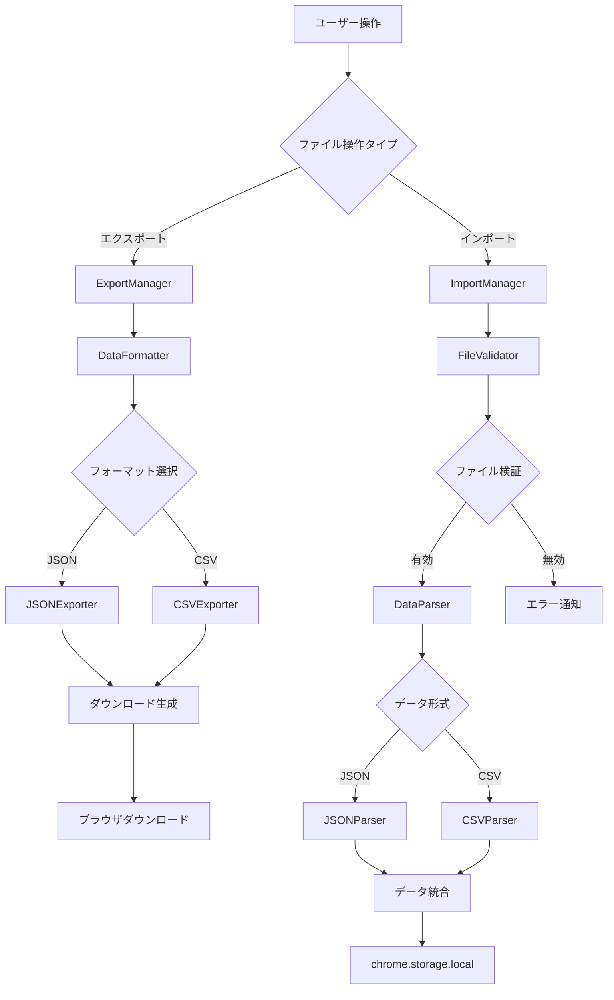
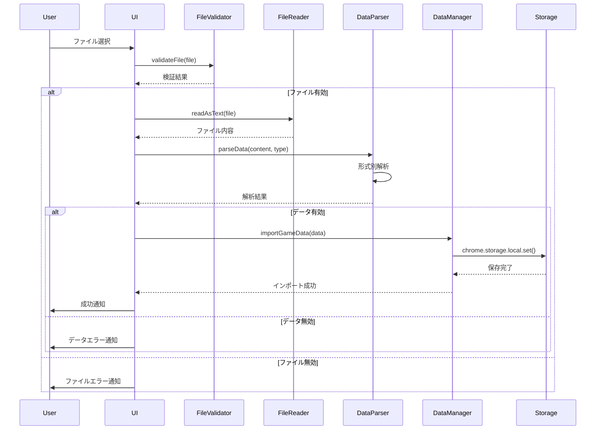

# ファイル処理

## 概要

ウディこん助のファイル処理システムは、v1.0.2で実装されたCSV対応データエクスポート・インポート機能を中心とした包括的なデータ管理機能です。Chrome拡張機能の制約下で、安全で信頼性の高いファイル操作を実現しています。

## ファイル処理アーキテクチャ

### システム構成


## ファイル処理コンポーネント

### 1. FileValidator.js ★NEW (v1.0.2)

#### バリデーション機能
```javascript
class FileValidator {
    constructor() {
        this.maxFileSize = 10 * 1024 * 1024; // 10MB制限
        this.allowedTypes = ['application/json', 'text/csv', 'text/plain'];
        this.allowedExtensions = ['.json', '.csv'];
    }
    
    // ファイル基本検証
    validateFile(file) {
        const errors = [];
        
        // ファイルサイズ検証
        if (file.size > this.maxFileSize) {
            errors.push(`ファイルサイズが上限(${this.maxFileSize / 1024 / 1024}MB)を超えています`);
        }
        
        // ファイル拡張子検証
        const extension = this.getFileExtension(file.name);
        if (!this.allowedExtensions.includes(extension)) {
            errors.push(`対応していないファイル形式です: ${extension}`);
        }
        
        // MIMEタイプ検証
        if (file.type && !this.allowedTypes.includes(file.type)) {
            console.warn(`MIME-Type警告: ${file.type} (許可は継続)`);
        }
        
        return {
            isValid: errors.length === 0,
            errors: errors,
            fileInfo: {
                name: file.name,
                size: file.size,
                type: file.type,
                extension: extension
            }
        };
    }
    
    // JSON構造検証
    validateJsonStructure(data) {
        if (!Array.isArray(data)) {
            return { isValid: false, error: 'JSONはゲームデータの配列である必要があります' };
        }
        
        const requiredFields = ['id', 'title', 'author'];
        const validationErrors = [];
        
        data.forEach((game, index) => {
            const missingFields = requiredFields.filter(field => !game[field]);
            if (missingFields.length > 0) {
                validationErrors.push(`${index + 1}行目: 必須フィールドが不足 [${missingFields.join(', ')}]`);
            }
        });
        
        return {
            isValid: validationErrors.length === 0,
            errors: validationErrors,
            recordCount: data.length
        };
    }
    
    // CSV構造検証
    validateCsvStructure(csvData) {
        if (!csvData || csvData.length === 0) {
            return { isValid: false, error: 'CSVデータが空です' };
        }
        
        const headers = csvData[0];
        const requiredHeaders = ['id', 'title', 'author'];
        const missingHeaders = requiredHeaders.filter(header => !headers.includes(header));
        
        if (missingHeaders.length > 0) {
            return { 
                isValid: false, 
                error: `必須ヘッダーが不足: ${missingHeaders.join(', ')}` 
            };
        }
        
        return {
            isValid: true,
            recordCount: csvData.length - 1, // ヘッダー行を除く
            headers: headers
        };
    }
}
```

### 2. エクスポート処理

#### CSVエクスポート
```javascript
class CSVExporter {
    constructor() {
        this.csvHeaders = [
            'id', 'title', 'author', 'updated_date',
            'heat', 'novelty', 'story', 'graphics', 'playability', 'other',
            'impressions', 'played', 'created_at', 'updated_at'
        ];
    }
    
    exportToCSV(gameData, year) {
        try {
            // CSVヘッダー作成
            const csvContent = [this.csvHeaders.join(',')];
            
            // データ行作成
            Object.values(gameData).forEach(game => {
                const row = this.csvHeaders.map(header => {
                    const value = game[header];
                    
                    // null/undefined処理
                    if (value === null || value === undefined) {
                        return '';
                    }
                    
                    // 文字列のCSVエスケープ
                    if (typeof value === 'string') {
                        return `"${value.replace(/"/g, '""')}"`;
                    }
                    
                    return value;
                });
                
                csvContent.push(row.join(','));
            });
            
            const csvString = csvContent.join('\n');
            const bom = '\uFEFF'; // UTF-8 BOM for Excel compatibility
            
            return this.generateDownload(
                bom + csvString,
                `wodicon_games_${year}.csv`,
                'text/csv;charset=utf-8'
            );
            
        } catch (error) {
            window.errorHandler.handleError(error, 'csv-export');
            throw error;
        }
    }
    
    generateDownload(content, filename, mimeType) {
        const blob = new Blob([content], { type: mimeType });
        const url = URL.createObjectURL(blob);
        
        const downloadLink = document.createElement('a');
        downloadLink.href = url;
        downloadLink.download = filename;
        downloadLink.style.display = 'none';
        
        document.body.appendChild(downloadLink);
        downloadLink.click();
        document.body.removeChild(downloadLink);
        
        // メモリリーク防止
        setTimeout(() => URL.revokeObjectURL(url), 1000);
        
        return {
            success: true,
            filename: filename,
            size: blob.size
        };
    }
}
```

#### JSONエクスポート
```javascript
class JSONExporter {
    exportToJSON(gameData, year) {
        try {
            const exportData = {
                metadata: {
                    version: '1.0.2',
                    year: year,
                    exported_at: new Date().toISOString(),
                    record_count: Object.keys(gameData).length
                },
                games: Object.values(gameData)
            };
            
            const jsonString = JSON.stringify(exportData, null, 2);
            
            return this.generateDownload(
                jsonString,
                `wodicon_games_${year}.json`,
                'application/json'
            );
            
        } catch (error) {
            window.errorHandler.handleError(error, 'json-export');
            throw error;
        }
    }
}
```

### 3. インポート処理

#### ファイル読み込みシーケンス


#### CSVインポート
```javascript
class CSVImporter {
    async importFromCSV(file) {
        try {
            const content = await this.readFile(file);
            const csvData = this.parseCSV(content);
            
            // CSV構造検証
            const validation = window.fileValidator.validateCsvStructure(csvData);
            if (!validation.isValid) {
                throw new Error(validation.error);
            }
            
            // データ変換
            const gameData = this.convertCSVToGameData(csvData);
            
            return {
                success: true,
                data: gameData,
                recordCount: validation.recordCount
            };
            
        } catch (error) {
            return {
                success: false,
                error: error.message
            };
        }
    }
    
    parseCSV(content) {
        const lines = content.split('\n').filter(line => line.trim());
        const headers = lines[0].split(',').map(header => header.trim().replace(/"/g, ''));
        
        const data = [headers];
        
        for (let i = 1; i < lines.length; i++) {
            const row = this.parseCSVRow(lines[i]);
            if (row.length === headers.length) {
                data.push(row);
            }
        }
        
        return data;
    }
    
    parseCSVRow(line) {
        const result = [];
        let currentField = '';
        let inQuotes = false;
        
        for (let i = 0; i < line.length; i++) {
            const char = line[i];
            
            if (char === '"') {
                if (inQuotes && line[i + 1] === '"') {
                    currentField += '"';
                    i++; // Skip next quote
                } else {
                    inQuotes = !inQuotes;
                }
            } else if (char === ',' && !inQuotes) {
                result.push(currentField.trim());
                currentField = '';
            } else {
                currentField += char;
            }
        }
        
        result.push(currentField.trim());
        return result;
    }
    
    convertCSVToGameData(csvData) {
        const headers = csvData[0];
        const gameData = {};
        
        for (let i = 1; i < csvData.length; i++) {
            const row = csvData[i];
            const game = {};
            
            headers.forEach((header, index) => {
                const value = row[index];
                
                // 数値フィールドの変換
                if (['heat', 'novelty', 'story', 'graphics', 'playability', 'other'].includes(header)) {
                    game[header] = value === '' ? null : parseFloat(value);
                }
                // ブール値フィールドの変換
                else if (header === 'played') {
                    game[header] = value === 'true' || value === '1';
                }
                // 文字列フィールド
                else {
                    game[header] = value === '' ? null : value;
                }
            });
            
            if (game.id) {
                gameData[game.id] = game;
            }
        }
        
        return gameData;
    }
    
    readFile(file) {
        return new Promise((resolve, reject) => {
            const reader = new FileReader();
            reader.onload = (event) => resolve(event.target.result);
            reader.onerror = (error) => reject(error);
            reader.readAsText(file, 'UTF-8');
        });
    }
}
```

#### JSONインポート
```javascript
class JSONImporter {
    async importFromJSON(file) {
        try {
            const content = await this.readFile(file);
            const jsonData = JSON.parse(content);
            
            // JSON構造検証
            let gameArray;
            if (jsonData.games && Array.isArray(jsonData.games)) {
                // メタデータ付きJSON
                gameArray = jsonData.games;
            } else if (Array.isArray(jsonData)) {
                // 単純な配列JSON
                gameArray = jsonData;
            } else {
                throw new Error('JSONの構造が正しくありません');
            }
            
            const validation = window.fileValidator.validateJsonStructure(gameArray);
            if (!validation.isValid) {
                throw new Error(validation.errors.join('\n'));
            }
            
            // データ変換
            const gameData = this.convertJSONToGameData(gameArray);
            
            return {
                success: true,
                data: gameData,
                recordCount: validation.recordCount
            };
            
        } catch (error) {
            return {
                success: false,
                error: error.message
            };
        }
    }
    
    convertJSONToGameData(gameArray) {
        const gameData = {};
        
        gameArray.forEach(game => {
            if (game.id) {
                // データ型正規化
                const normalizedGame = this.normalizeGameData(game);
                gameData[game.id] = normalizedGame;
            }
        });
        
        return gameData;
    }
    
    normalizeGameData(game) {
        const normalized = { ...game };
        
        // 評価値の正規化
        const ratingFields = ['heat', 'novelty', 'story', 'graphics', 'playability', 'other'];
        ratingFields.forEach(field => {
            if (normalized[field] !== null && normalized[field] !== undefined) {
                const value = parseFloat(normalized[field]);
                normalized[field] = isNaN(value) ? null : Math.max(0, Math.min(10, value));
            }
        });
        
        // 日付フィールドの正規化
        if (normalized.created_at && typeof normalized.created_at === 'string') {
            normalized.created_at = new Date(normalized.created_at).getTime();
        }
        if (normalized.updated_at && typeof normalized.updated_at === 'string') {
            normalized.updated_at = new Date(normalized.updated_at).getTime();
        }
        
        return normalized;
    }
}
```

## データ統合・マージ処理

### インポート時の競合解決
```javascript
class DataMerger {
    async mergeImportedData(importedData, existingData, mergeStrategy = 'ask') {
        const conflicts = this.detectConflicts(importedData, existingData);
        
        if (conflicts.length === 0) {
            // 競合なし: 単純統合
            return { ...existingData, ...importedData };
        }
        
        switch (mergeStrategy) {
            case 'overwrite':
                return { ...existingData, ...importedData };
                
            case 'keep_existing':
                const result = { ...existingData };
                Object.keys(importedData).forEach(id => {
                    if (!existingData[id]) {
                        result[id] = importedData[id];
                    }
                });
                return result;
                
            case 'ask':
            default:
                return await this.resolveConflictsInteractively(conflicts, existingData, importedData);
        }
    }
    
    detectConflicts(importedData, existingData) {
        const conflicts = [];
        
        Object.keys(importedData).forEach(id => {
            if (existingData[id]) {
                const existing = existingData[id];
                const imported = importedData[id];
                
                // データ差分検出
                if (this.hasSignificantDifferences(existing, imported)) {
                    conflicts.push({
                        id: id,
                        existing: existing,
                        imported: imported,
                        differences: this.findDifferences(existing, imported)
                    });
                }
            }
        });
        
        return conflicts;
    }
    
    async resolveConflictsInteractively(conflicts, existingData, importedData) {
        // UI での競合解決ダイアログ実装予定
        // 現在は上書き方式で実装
        console.warn(`${conflicts.length}件の競合を検出。上書きで処理します。`);
        return { ...existingData, ...importedData };
    }
}
```

## エラーハンドリング・復旧

### ファイル処理エラー対応
```javascript
class FileProcessingErrorHandler {
    handleImportError(error, context) {
        const errorTypes = {
            'file_size_exceeded': {
                message: 'ファイルサイズが大きすぎます',
                recovery: 'ファイルを分割してインポートしてください'
            },
            'invalid_format': {
                message: 'ファイル形式が正しくありません',
                recovery: 'JSON またはCSV形式のファイルを使用してください'
            },
            'parsing_error': {
                message: 'ファイルの解析に失敗しました',
                recovery: 'ファイルの内容を確認してください'
            },
            'storage_error': {
                message: 'データの保存に失敗しました',
                recovery: 'ストレージ容量を確認してください'
            }
        };
        
        const errorType = this.categorizeError(error);
        const errorInfo = errorTypes[errorType] || {
            message: 'インポート処理でエラーが発生しました',
            recovery: 'ファイルを確認して再度お試しください'
        };
        
        // ユーザー通知
        this.showErrorDialog(errorInfo, context);
        
        // エラーログ保存
        window.errorHandler.handleError(error, 'file-import', {
            errorType: errorType,
            context: context
        });
    }
    
    categorizeError(error) {
        const message = error.message.toLowerCase();
        
        if (message.includes('size')) return 'file_size_exceeded';
        if (message.includes('format') || message.includes('extension')) return 'invalid_format';
        if (message.includes('parse') || message.includes('json') || message.includes('csv')) return 'parsing_error';
        if (message.includes('storage') || message.includes('quota')) return 'storage_error';
        
        return 'unknown_error';
    }
}
```

### バックアップ・復元機能
```javascript
class BackupManager {
    async createBackup(year = null) {
        try {
            const currentYear = year || await window.yearManager.getCurrentYear();
            const gameData = await window.gameDataManager.loadYearData(currentYear);
            
            const backupData = {
                metadata: {
                    version: '1.0.2',
                    year: currentYear,
                    created_at: new Date().toISOString(),
                    type: 'backup'
                },
                games: Object.values(gameData)
            };
            
            const filename = `wodicon_backup_${currentYear}_${this.formatDate(new Date())}.json`;
            
            return window.csvExporter.generateDownload(
                JSON.stringify(backupData, null, 2),
                filename,
                'application/json'
            );
            
        } catch (error) {
            window.errorHandler.handleError(error, 'backup-creation');
            throw error;
        }
    }
    
    formatDate(date) {
        return date.toISOString().slice(0, 19).replace(/:/g, '-');
    }
}
```

## パフォーマンス最適化

### 大容量ファイル処理
```javascript
class LargeFileProcessor {
    async processLargeFile(file, chunkSize = 1024 * 1024) { // 1MB chunks
        const totalChunks = Math.ceil(file.size / chunkSize);
        const chunks = [];
        
        for (let i = 0; i < totalChunks; i++) {
            const start = i * chunkSize;
            const end = Math.min(start + chunkSize, file.size);
            const chunk = file.slice(start, end);
            
            const chunkContent = await this.readChunk(chunk);
            chunks.push(chunkContent);
            
            // プログレス通知
            this.notifyProgress(i + 1, totalChunks);
        }
        
        return chunks.join('');
    }
    
    readChunk(chunk) {
        return new Promise((resolve, reject) => {
            const reader = new FileReader();
            reader.onload = (e) => resolve(e.target.result);
            reader.onerror = reject;
            reader.readAsText(chunk, 'UTF-8');
        });
    }
}
```

### メモリ使用量最適化
```javascript
class MemoryOptimizer {
    processDataInBatches(data, batchSize = 100) {
        const batches = [];
        const dataArray = Array.isArray(data) ? data : Object.values(data);
        
        for (let i = 0; i < dataArray.length; i += batchSize) {
            batches.push(dataArray.slice(i, i + batchSize));
        }
        
        return batches;
    }
    
    async processBatchSequentially(batches, processor) {
        const results = [];
        
        for (const batch of batches) {
            try {
                const result = await processor(batch);
                results.push(result);
                
                // ガベージコレクション促進
                if (results.length % 10 === 0) {
                    await this.sleep(10);
                }
            } catch (error) {
                console.error('バッチ処理エラー:', error);
            }
        }
        
        return results.flat();
    }
    
    sleep(ms) {
        return new Promise(resolve => setTimeout(resolve, ms));
    }
}
```

## 今後の拡張計画

### ファイル形式対応拡張
- **Excel形式**: .xlsx ファイルの直接インポート
- **YAML形式**: 設定ファイル的用途での YAML サポート
- **XML形式**: 他システムとの連携用 XML エクスポート

### 高度なデータ処理
- **データ変換ルール**: カスタム変換ルールの設定
- **フィールドマッピング**: 異なるスキーマでのインポート
- **データクリーニング**: 重複削除・正規化の自動実行

### ユーザビリティ向上
- **ドラッグ&ドロップ**: ファイルの直感的アップロード
- **プレビュー機能**: インポート前のデータ確認
- **進捗表示**: 大容量ファイル処理の視覚的フィードバック